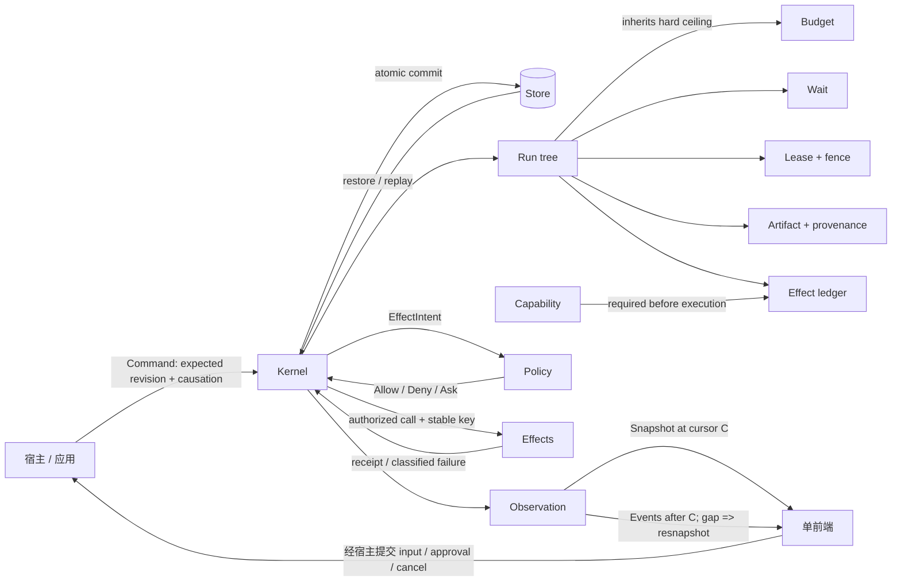

# Rust Agent Kernel 最小接口面提案

> 状态：v1 收敛提案；研究日期：2026-08-18。  
> 目标场景：同一进程、同一版本、单一前端；kernel 作为 Rust 依赖库嵌入宿主。  
> 判定依据：[规范税系](./taxonomy.md)、[反模式清单](./anti-patterns.md)、[kernel/frontend 先例笔记](../precedents/kernel-frontend-split.md)、[xi 与编辑器先例笔记](../precedents/xi-and-editors.md)。

## 0. 一句话裁决

v1 的稳定窄腰不是 `Agent/Crew/Graph/Tool/UI`，而是：**一个单 owner、可持久恢复的运行事实机；宿主用幂等命令驱动它，用显式 effect 回调连接外界，用 snapshot + 有序 event 观察它。**

只提供五个宿主操作：`open / submit / drive / snapshot / subscribe`；只要求三个宿主端口：`Store / Policy / Effects`。`Start/Spawn/Wait/Signal/Effect/Capability/Lease/Artifact` 是命令数据，而不是各自膨胀成 service、manager 或 DSL。

---

## 1. 概念模型

### 1.1 核心名词（恰好 10 个）

| 名词 | 最小含义 | 明确不代表 |
|---|---|---|
| **Kernel** | 单一线性化点；校验命令、推进事实状态、持久化后发布事件 | 进程、HTTP server、模型 runtime |
| **Run** | 有稳定 ID、父子血缘、预算、deadline 和明确终态的执行单元；agent/task 都投影为 Run | role、persona、业务 workflow step 类型系统 |
| **Command** | 宿主提交的幂等意图，带 command ID、expected revision、actor 与 causation | UI click、自然语言自述 |
| **Observation** | 成对的权威 `Snapshot` 与有序 `Event`；cursor gap 后只能重新 snapshot | 日志、token 流、前端 cache |
| **Effect** | 所有外部 I/O 的事实边界：propose → authorize → claim/attempt → execute → record | “模型说工具已执行”、通用 exactly-once |
| **Wait** | 可恢复等待：child join、timer、message、人工 input/approval 都有稳定 request ID 与 expiry | console stdin、异常字符串、裸 bool callback |
| **Capability** | opaque、可缩权、可撤销的未来 effect 调用凭据 | tool 名、RBAC/IAM 本体、可倒带的撤销 |
| **Budget** | 对整棵 Run 树原子执行的硬上限与背压计量 | 排序、模型选择、质量/成本优化策略 |
| **Lease** | 对资源/控制权/attempt 的期限、续租与 fencing 事实 | 资源业务含义、健康阈值、物理动作已停止 |
| **Artifact** | immutable content reference + workspace revision/CAS + producer/input provenance | blob store、Git/向量库、领域 schema、自动 merge |

`Message` 不是第 11 个核心对象：它是一次有界、持久的 coordination command/event。`Agent` 也不是独立 kernel 类型：需要独立生命周期、预算和权限的参与者就是 child `Run`；显示角色属于应用/前端。

### 1.2 关系图



关键关系：

1. `Store` 的状态提交与事件追加必须是一个原子 CAS；事件只能在 commit 成功后可见。
2. `Policy` 只能返回决定，`Effects` 只能执行已由 kernel 进入 authorized/claimed 状态的调用；二者回调均不得重入同一 Kernel。
3. child 的 capability、budget、deadline 只能相对 parent 缩小；Run 终态后旧 signal/cursor-relative handle 变 stale。
4. frontend 只看 Observation、提交 Command；它不是 `EffectReceipt`、approval、lease 或 terminal 的事实源。

---

## 2. 库 vs 协议：本场景的边界裁决

### 2.1 为什么先做进程内 Rust 库

**xi 是最直接的反证。** xi 为跨语言 frontend 把 core 分进程并自建 JSON-RPC，结果不只是序列化开销：Swift JSON 慢、`serde` 增体积、滚动 cache 协调耗时数月，编辑与 rewrap 产生 race/tearing；core 还要反向 RPC `measure_width`，说明强耦合并未消失，只被改写成时序和 cache 一致性。作者最终明确认为 core/frontend process separation “was not a good idea”，并称 async 是复杂度乘数。[xi retrospective](https://raphlinus.github.io/xi/2020/06/27/xi-retrospective.html)、[xi frontend protocol](https://xi-editor.io/docs/frontend-protocol.html)。

当前只有一个与 kernel 同版本、同进程、同产品的前端，没有 LSP 所解决的“多个编辑器 × 多个语言服务器”N×M 问题，也没有 Jupyter 多 frontend/远程 kernel 的既成需求。此时先冻结 wire schema 会立刻承担认证、framing、序列化、版本偏差、断连、背压、重连和兼容测试，却没有换来真实的语言/故障域独立。

因此边界切在：

- **稳定 domain semantics**：owned Rust DTO、Command、Snapshot/Event、错误码、cursor/revision、取消/终态、effect/signal 生命周期；
- **非稳定 process mechanics**：前端直接持有 `Kernel` Rust handle；UI framework、窗口生命周期、事件循环与 adapter 留在宿主；
- **未来 wire adapter**：只能投影上述稳定语义，不反过来要求 core 镜像某个 JSON object tree。

### 2.2 Jupyter/LSP 值得借什么，不值得复制什么

Jupyter 证明不同交互时程不能退化为一个 `send`：Shell request/reply、IOPub broadcast、stdin reverse request、Control 高优先级路径、Heartbeat 各有不同 QoS；不支持 stdin 的前端必须提前声明，否则 kernel 会阻塞。它还承认 `idle` 后异步 output 未定义，说明“流安静了”不能当 terminal。[Jupyter messaging](https://jupyter-client.readthedocs.io/en/latest/messaging.html)。本提案借用的是**语义分层**：普通命令、显式 Wait、可抢占 cancel、权威 terminal、best-effort UX 流分开；不复制五个 socket。

LSP 证明协议公开后必须承担 request ID、response 闭合、初始化/capability、错误码与取消语义：即使 request 被取消，原 request 仍必须返回 response；progress 也不是 terminal。[LSP 3.17](https://microsoft.github.io/language-server-protocol/specifications/lsp/3.17/specification/)。本提案让 `submit` 只在 durable acceptance 后返回，取消只返回“已接受取消意图”，Run 最终仍以 `Terminal` event 闭合；但 v1 不因这个语义同构就套 JSON-RPC。

### 2.3 何时才值得协议化

满足下列**触发信号中的至少一项**，且团队愿意承担后面的运营条件，才新增独立 `kernel-protocol` adapter；“以后也许会有”不算：

1. 已有至少两个真实、独立发布且版本不会锁步的 consumer；
2. consumer 使用不同语言，Rust/C ABI 不再合适；
3. 必须远程/跨机器，或 kernel 与宿主需要独立重启、crash containment；
4. 插件/tool host 不可信，进程/sandbox 边界确实提供权限隔离；
5. 多 controller/observer、跨租户或多前端是已验证产品需求。

协议化前还必须能持续承诺：认证与 controller ownership、版本/能力协商、request/response 关联、背压和 payload 上限、重连与 cursor expiry、未知字段/错误码演进、跨版本 contract tests。若数据流不能收敛为有限的 Command/Snapshot/Event/Effect/Wait，而仍依赖 UI 像素或同步反向 callback，则说明边界尚未成熟，不应协议化。

未来 adapter 应遵循 LSP 式 additive capability（未知能力忽略、缺失即不支持），而非把 v1 Rust enum 原样承诺成永久 JSON vocabulary。`kernel-core` 仍不拥有 socket、线程、Tokio、WebSocket 或认证。

---

## 3. v1 稳定公共 API 全集

### 3.1 总体约束

- 以下代码块是 **v1 全部稳定 public surface**；除标准 trait implementation（`Clone/Debug/Future/Stream` 等）外，不再公开 manager、registry、provider object 或内部 state。
- DTO 全部 owned；示例用 `Vec<u8>` 表示宿主约定 schema 的 canonical bytes，不把 JSON/Protobuf/LLM provider 类型写进 ABI。
- `LocalBoxFuture` 故意不要求 `Send`：core 可用于单线程 GUI/WASM，也不拥有 executor。多线程宿主可返回 `Send` future 并在自己的 runtime 上 poll；若未来真实需要 dyn + Send facade，再作为 adapter 增加。
- 所有可变提交由 Kernel 内部单 owner 串行线性化。不同 `Kernel` 可并行；同一 Kernel 并发 `drive` 返回 `Busy`，不会重入。
- 宿主必须持续 poll `drive`：library 不暗中 spawn thread/task。`DriveReport.next_wakeup` 是宿主设置 timer 的唯一依据。

### 3.2 基础类型、DTO 与错误

```rust
use core::{future::Future, pin::Pin, task::{Context, Poll}};
use std::{num::{NonZeroU32, NonZeroUsize}, rc::Rc};

pub type LocalBoxFuture<'a, T> = Pin<Box<dyn Future<Output = T> + 'a>>;

// nominal；除明确由宿主创建的三种 ID 外，字节表示私有且 ID 不是权限本身。
pub struct KernelId(pub [u8; 16]);      // 宿主选择持久 kernel identity
pub struct CommandId(pub [u8; 16]);     // 宿主生成，用作幂等提交键
pub struct ArtifactId(pub [u8; 32]);    // 宿主按 canonical content digest 生成
pub struct RunId([u8; 16]);
pub struct EffectId([u8; 16]);
pub struct WaitId([u8; 16]);
pub struct CapabilityId([u8; 16]);
pub struct LeaseId([u8; 16]);
pub struct SubjectId(pub String);

pub struct Revision(pub u64);
pub struct Cursor(pub u64);
pub struct TimestampMs(pub u64);       // 宿主提供的持久时间轴；同一 kernel 不得倒退
pub struct Fence(pub u64);
pub struct StableKey(pub String);      // 作用域内稳定；不可用随机 attempt ID 替代
pub struct SchemaId(pub String);
pub struct ResourceId(pub String);
pub struct OperationId(pub String);

pub struct Payload {
    pub schema: SchemaId,
    pub bytes: Vec<u8>,
}

pub struct KernelConfig {
    pub id: KernelId,
    pub code_revision: String,
    pub limits: BudgetLimit,
    pub event_page_size: NonZeroUsize,
    pub effect_claim_ttl_ms: u64,
}

pub enum OpenMode {
    Create,
    Recover,
}

pub struct BudgetLimit {
    pub max_depth: NonZeroU32,
    pub max_children: u32,
    pub max_concurrent: NonZeroU32,
    pub max_effect_attempts: NonZeroU32,
    pub max_messages: u64,
    pub max_items: u64,
    pub max_bytes: u64,                 // 对所有表示统一计量，不只 text
    pub max_payload_bytes: u64,
}

pub struct BudgetUsage {
    pub children: u32,
    pub concurrent: u32,
    pub effect_attempts: u32,
    pub messages: u64,
    pub items: u64,
    pub bytes: u64,
}

#[non_exhaustive]
pub enum ErrorCode {
    NotFound,
    AlreadyExists,
    Conflict,
    InvalidTransition,
    StaleHandle,
    CursorExpired,
    BudgetExceeded,
    Backpressured,
    Unauthorized,
    DeadlineExceeded,
    CancellationTimedOut,
    NeedsMigration,
    CorruptState,
    Busy,
    HostUnavailable,
    Internal,
}

pub struct KernelError {
    pub code: ErrorCode,
    pub message: String,                // 仅供诊断，不参与控制流
    pub retry_after_ms: Option<u64>,
}

#[non_exhaustive]
pub enum HostErrorKind {
    Conflict,
    Unavailable,
    InvalidData,
    Permanent,
}

pub struct HostError {
    pub kind: HostErrorKind,
    pub code: String,
    pub message: String,
    pub retry_after_ms: Option<u64>,
}
```

时间语义：`TimestampMs` 是宿主选择并持久化的一致时间轴（通常 Unix epoch ms）；Kernel 拒绝早于已提交时间的 `drive(now)`。它不是 event arrival time，也不从 `SystemTime::now()` 隐式读取。这样 timer/deadline 可测试、可恢复。

### 3.3 宿主必须实现的回调

```rust
pub trait Store {
    fn load<'a>(
        &'a self,
        kernel: &'a KernelId,
    ) -> LocalBoxFuture<'a, Result<Option<StoredKernel>, HostError>>;

    // 必须线性化：expected_revision 匹配时，state 与 events 全部提交；
    // 不匹配则返回 Conflict；绝不可只落其中一半。
    fn commit<'a>(
        &'a self,
        batch: StoreCommit,
    ) -> LocalBoxFuture<'a, Result<(), HostError>>;

    fn read_events<'a>(
        &'a self,
        query: EventQuery,
    ) -> LocalBoxFuture<'a, Result<EventPage, HostError>>;
}

pub struct StoredKernel {
    pub revision: Revision,
    pub last_cursor: Cursor,
    pub code_revision: String,
    pub state_format: u32,
    pub state: Vec<u8>,                  // kernel-owned opaque encoding
}

pub struct StoreCommit {
    pub kernel: KernelId,
    pub expected_revision: Revision,
    pub new_revision: Revision,
    pub state_format: u32,
    pub state: Vec<u8>,
    pub events: Vec<KernelEvent>,        // cursor 连续，且仅在 commit 成功后可见
}

pub struct EventQuery {
    pub kernel: KernelId,
    pub after: Cursor,
    pub limit: NonZeroUsize,
}

pub enum EventPage {
    Batch {
        events: Vec<KernelEvent>,
        next: Cursor,
        caught_up: bool,
    },
    Expired {
        earliest: Cursor,
        latest: Cursor,
    },
}

pub trait Policy {
    // 每个 attempt 都执行；不得由 pre-approval 或恢复路径跳过。
    // 回调只能返回决定，不得同步/异步调用同一 Kernel。
    fn authorize<'a>(
        &'a self,
        intent: EffectIntent,
    ) -> LocalBoxFuture<'a, Result<Authorization, HostError>>;
}

pub enum Authorization {
    Allow,
    Deny { reason: String },
    Ask { request: InputRequest },       // kernel 将其持久化为 Wait 后才对前端可见
}

pub trait Effects {
    // 至少一次 attempt；宿主必须把 idempotency_key 传给支持它的下游。
    // 返回只说明本次可观察 receipt，不等于全世界 exactly-once。
    fn execute<'a>(
        &'a self,
        call: EffectCall,
    ) -> LocalBoxFuture<'a, Result<EffectReceipt, HostError>>;

    // best effort 控制路径；Accepted 不等于外部动作已停止。
    fn cancel<'a>(
        &'a self,
        effect: EffectId,
        fence: Fence,
    ) -> LocalBoxFuture<'a, Result<CancelDisposition, HostError>>;
}

pub struct EffectIntent {
    pub effect: EffectId,
    pub run: RunId,
    pub operation: OperationId,
    pub resource: ResourceId,
    pub input: Payload,
    pub capability: CapabilityId,
    pub idempotency_key: StableKey,
    pub attempt: u32,
    pub deadline: Option<TimestampMs>,
}

pub struct EffectCall {
    pub intent: EffectIntent,
    pub fence: Fence,
}

pub enum EffectReceipt {
    Succeeded { output: Payload, external_receipt: Option<Payload> },
    Failed { kind: EffectFailureKind, detail: Payload },
    Unknown { detail: Payload },         // crash/timeout 窗口无法确认是否发生
}

pub enum EffectFailureKind {
    Rejected,
    InvalidInput,
    Unavailable,
    TimedOut,
    Cancelled,
    Permanent,
}

pub enum CancelDisposition {
    Accepted,
    AlreadyFinished,
    NotInterruptible,
    Unknown,
}
```

回调契约：

- Kernel 不在持有同一 Run 的可变提交锁时调用回调；回调完成后重新 CAS，冲突则按 ledger 对账，不重复伪造事实。
- callback 不能 reenter 当前 Kernel；检测到重入返回 `Busy`。这避免 SQLite/OTP/Orleans 类 await 环。
- `Policy::authorize` 与 `Effects::execute` 都可能慢或失败，因此只能由显式 `drive` poll；前端断开不影响其正确性。
- `Store` 决定数据库、retention、加密与迁移运营；Kernel 决定 state/event 原子性、revision 和恢复兼容。
- `Effects` 决定 HTTP/MCP/LLM/shell/sandbox；Kernel 决定 capability、claim、attempt、fence、deadline 与 outcome ledger。

### 3.4 宿主可调用的操作

```rust
pub struct Kernel {
    // opaque；可 Clone 的本地 handle，非 Send，内部状态单 owner
    _private: (),
}

impl Kernel {
    pub async fn open(
        mode: OpenMode,
        config: KernelConfig,
        store: Rc<dyn Store>,
        policy: Rc<dyn Policy>,
        effects: Rc<dyn Effects>,
    ) -> Result<Self, KernelError>;

    // 仅在 command 与其事实事件 durable commit 后返回；相同 CommandId 幂等返回原 ack。
    pub async fn submit(&self, command: Command) -> Result<CommandAck, KernelError>;

    // bounded 地推进 timer、wait、cancel、policy 与 effect work；不暗中 spawn。
    pub async fn drive(&self, request: DriveRequest) -> Result<DriveReport, KernelError>;

    // 返回与 at_cursor 一致的权威投影；不得返回前端 cache patch。
    pub async fn snapshot(&self, query: SnapshotQuery) -> Result<Snapshot, KernelError>;

    // 从 Store replay 后跟随 live commits；流本身不是 authority。
    pub fn subscribe(&self, subscription: Subscription) -> EventStream;
}

pub struct DriveRequest {
    pub now: TimestampMs,
    pub max_transitions: NonZeroU32,
    pub max_effects: NonZeroU32,
}

pub struct DriveReport {
    pub transitions: u32,
    pub effects_attempted: u32,
    pub more_work: bool,
    pub next_wakeup: Option<TimestampMs>,
}

pub struct Command {
    pub id: CommandId,
    pub expected_revision: Option<Revision>,
    pub actor: SubjectId,
    pub causation: Option<CommandId>,
    pub kind: CommandKind,
}

pub enum CommandKind {
    Run(RunOp),
    Coordinate(CoordinationOp),
    Effect(EffectProposal),
    Authority(CapabilityOp),
    Resource(ResourceOp),
}

pub enum RunOp {
    Start { spec: RunSpec },
    Spawn { parent: RunId, key: StableKey, spec: RunSpec },
    Finish { run: RunId, outcome: RunOutcome },
    Cancel { run: RunId, reason: Payload },
}

pub struct RunSpec {
    pub kind: SchemaId,                  // app-defined dispatch key，不是 role/persona
    pub input: Payload,
    pub budget: BudgetLimit,             // child 必须 <= parent 剩余 hard ceiling
    pub deadline: Option<TimestampMs>,
}

pub enum RunOutcome {
    Succeeded { result: Payload, artifacts: Vec<ArtifactId> },
    Failed { kind: String, detail: Payload },
}

pub enum CoordinationOp {
    Send {
        from: RunId,
        to: RunId,
        key: StableKey,
        payload: Payload,
        deadline: Option<TimestampMs>,
    },
    Wait {
        run: RunId,
        key: StableKey,
        condition: WaitCondition,
    },
    Respond {
        run: RunId,
        wait: WaitId,
        response: WaitResponse,
    },
}

pub enum WaitCondition {
    Children { runs: Vec<RunId>, mode: JoinMode },
    Message { schema: SchemaId, expires_at: TimestampMs },
    Input(InputRequest),
    Until(TimestampMs),
}

pub enum JoinMode {
    All,
    Any,
}

pub struct InputRequest {
    pub schema: SchemaId,
    pub prompt_key: String,              // app/frontend 解释；kernel 不生成文案
    pub expires_at: TimestampMs,
}

pub enum WaitResponse {
    Input(Payload),
    Approve,
    Deny { reason: Payload },
    Cancel,
}

pub struct EffectProposal {
    pub run: RunId,
    pub key: StableKey,
    pub operation: OperationId,
    pub resource: ResourceId,
    pub input: Payload,
    pub capability: CapabilityId,
    pub deadline: Option<TimestampMs>,
}

pub enum CapabilityOp {
    Grant {
        target: RunId,
        parent: Option<CapabilityId>,     // None 只表示“可信嵌入宿主授予 root facet”
        scope: CapabilityScope,
        expires_at: Option<TimestampMs>,
    },
    Revoke { capability: CapabilityId },
}

pub struct CapabilityScope {
    pub resources: Vec<ResourceId>,
    pub operations: Vec<OperationId>,
    pub budget: BudgetLimit,
}

pub enum ResourceOp {
    Lease(LeaseOp),
    Artifact(ArtifactOp),
}

pub enum LeaseOp {
    Acquire {
        run: RunId,
        resource: ResourceId,
        ttl_ms: u64,
    },
    Renew {
        lease: LeaseId,
        fence: Fence,
        ttl_ms: u64,
    },
    Release {
        lease: LeaseId,
        fence: Fence,
    },
}

pub enum ArtifactOp {
    Publish {
        run: RunId,
        expected_workspace: Revision,
        artifact: ArtifactRef,
        inputs: Vec<ArtifactId>,
    },
    Invalidate {
        run: RunId,
        artifact: ArtifactId,
        reason: Payload,
    },
}

pub struct ArtifactRef {
    pub id: ArtifactId,                  // content digest
    pub media_type: String,
    pub size_bytes: u64,
    pub locator: String,                 // opaque to kernel; blob implementation is external
}

pub struct CommandAck {
    pub command: CommandId,
    pub revision: Revision,
    pub cursor: Cursor,
    pub created_run: Option<RunId>,
    pub created_wait: Option<WaitId>,
    pub created_capability: Option<CapabilityId>,
    pub lease: Option<LeaseGrant>,
}

pub struct LeaseGrant {
    pub lease: LeaseId,
    pub fence: Fence,
    pub expires_at: TimestampMs,
}
```

操作语义：

- `open(Create)` 遇到已有状态返回 `AlreadyExists`；`open(Recover)` 遇到缺失、损坏或代码 revision 不兼容分别返回 `NotFound / CorruptState / NeedsMigration`，绝不静默创建新 Run。
- `submit` 是 cancel-safe 的唯一线性化操作：Future 返回前，命令要么未提交，要么状态与事件已一同提交；`CommandId` 重试得到同一 ack。`expected_revision` 缺失表示允许在当前 revision 排队，但 capability/artifact/lease 等敏感修改应由宿主填入以获得 CAS。
- `RunOp::Cancel` 的 ack 只表示 cancellation intent 已持久化。之后状态是 `Cancelling`；取消自动向未终态 descendants 传播，`Effects::cancel` 可能返回不可中断，最终只能由 `Terminal(Cancelled/Failed/Succeeded)` 闭合。child failure 必须在 parent 的 Observation 中可见并可解除对应 Join，但 Kernel 不自选 restart/supervisor 策略。不能承诺已发生物理动作倒带。
- `RunOp::Finish` 由 app 声明业务结果，但 Kernel 只在无未决强制 Wait/effect、预算账本一致且状态转移合法时接受。
- `drive` 每次只做有限工作，达到限制即 `more_work=true`；宿主应尽快再 poll。若只有未来 timer，则按 `next_wakeup` 调度。drop 一个 `drive` future 不会撤销已 durable claim；claim 过期后的重试使用同一 StableKey、新 attempt 与更高 Fence，并可能得到 `Unknown`。
- `CapabilityOp::Grant(parent=Some)` 强制 scope、expiry、budget 都不超过 parent；revoke 只阻止未来经 kernel 的调用。`parent=None` 是可信嵌入宿主的 trust root，不宣称抵抗能直接绕开本库的恶意宿主。
- `LeaseOp::Renew` 同时承担 heartbeat 的最小机制：续租是 durable fact，过期使旧 fence 失效；“多久续、何时判健康、物理资源怎么复位”仍由 app 决定，不新增通用 heartbeat service。
- `ArtifactOp` 只记录 immutable ref、workspace CAS 和 provenance；locator 可由宿主解释为 DB/Git/object store，但 Kernel 不解引用、不 merge。

### 3.5 宿主可订阅的事件流

```rust
pub struct SnapshotQuery {
    pub run: RunId,
    pub include_descendants: bool,
}

pub struct Snapshot {
    pub kernel: KernelId,
    pub revision: Revision,
    pub at_cursor: Cursor,
    pub code_revision: String,
    pub run: RunView,
    pub descendants: Vec<RunView>,
}

pub struct RunView {
    pub id: RunId,
    pub parent: Option<RunId>,
    pub status: RunStatus,
    pub deadline: Option<TimestampMs>,
    pub budget_limit: BudgetLimit,
    pub budget_usage: BudgetUsage,
    pub children: Vec<RunId>,
    pub waits: Vec<WaitView>,
    pub capabilities: Vec<CapabilityView>,
    pub leases: Vec<LeaseView>,
    pub workspace_revision: Revision,
    pub artifacts: Vec<ArtifactView>,
}

pub enum RunStatus {
    Pending,
    Running,
    Waiting,
    Cancelling,
    Succeeded,
    Failed,
    Cancelled,
}

pub struct WaitView {
    pub id: WaitId,
    pub state: WaitState,
    pub expires_at: Option<TimestampMs>,
}

pub enum WaitState { Open, Resolved, Expired, Cancelled }

pub struct CapabilityView {
    pub id: CapabilityId,
    pub scope: CapabilityScope,
    pub expires_at: Option<TimestampMs>,
    pub revoked: bool,
}

pub struct LeaseView {
    pub id: LeaseId,
    pub resource: ResourceId,
    pub fence: Fence,
    pub expires_at: TimestampMs,
}

pub struct ArtifactView {
    pub artifact: ArtifactRef,
    pub producer: RunId,
    pub inputs: Vec<ArtifactId>,
    pub workspace_revision: Revision,
    pub valid: bool,
}

pub struct Subscription {
    pub after: Cursor,
    pub filter: EventFilter,
    pub max_batch: NonZeroUsize,
}

pub enum EventFilter {
    Kernel,
    Run { root: RunId, include_descendants: bool },
}

pub struct EventStream { _private: () }

impl futures_core::Stream for EventStream {
    type Item = Result<EventBatch, StreamError>;
    fn poll_next(
        self: Pin<&mut Self>,
        cx: &mut Context<'_>,
    ) -> Poll<Option<Self::Item>>;
}

pub struct EventBatch {
    pub events: Vec<KernelEvent>,
    pub next: Cursor,
    pub caught_up: bool,
}

pub enum StreamError {
    Gap { earliest: Cursor, latest: Cursor },
    Closed,
    Host(HostError),
}

pub struct KernelEvent {
    pub cursor: Cursor,
    pub revision: Revision,
    pub recorded_at: TimestampMs,
    pub run: RunId,
    pub command: Option<CommandId>,
    pub causation: Option<CommandId>,
    pub kind: EventKind,
}

pub enum EventKind {
    RunCreated { parent: Option<RunId> },
    StateChanged { from: RunStatus, to: RunStatus, reason: Option<Payload> },
    MessageCommitted { from: RunId, to: RunId, key: StableKey, payload: Payload },
    WaitChanged { wait: WaitId, state: WaitState },
    EffectChanged { effect: EffectId, state: EffectState, attempt: u32, fence: Fence },
    CapabilityChanged { capability: CapabilityId, revoked: bool },
    LeaseChanged { lease: LeaseId, fence: Fence, active: bool },
    ArtifactChanged { artifact: ArtifactId, workspace_revision: Revision, valid: bool },
    BudgetCharged { usage: BudgetUsage },
    Terminal { outcome: TerminalOutcome },
}

pub enum EffectState {
    Proposed,
    WaitingForApproval { wait: WaitId },
    Authorized,
    Claimed,
    Succeeded,
    Failed { kind: EffectFailureKind },
    OutcomeUnknown,
    CancelRequested,
}

pub enum TerminalOutcome {
    Succeeded,
    Failed { kind: String },
    Cancelled,
}
```

事件顺序保证（稳定契约）：

1. **范围**：同一 `KernelId` 内 cursor 严格递增，提供全局 total order；revision 对一次原子 command/drive commit 递增，同一 revision 的事件 cursor 连续。不同 Kernel 无顺序保证。
2. **可见性**：`submit`/`drive` 只有在状态与对应事件同一 `Store::commit` 成功后才返回；subscriber 不会看到未提交事件。重复读取/重连可以重复交付，consumer 按 cursor 去重。
3. **终态**：每个 Run 恰有一个 `Terminal`；它是该 Run 最后一个可改变运行事实的事件。provider token 结束、stream close、cleanup、heartbeat、progress 都不是终态。
4. **snapshot/watch 接缝**：`snapshot.at_cursor=C` 后从 `Subscription.after=C` 订阅。若 Store 已清理 C，流先返回一次 `Gap` 后结束；固定恢复动作是重新 snapshot，不允许前端猜补丁。
5. **背压**：`max_batch`、Store retention 和全局 budget 都有界。`EventStream` 只保存 wakeup，不为慢 consumer 永久缓存事件；事件从 Store 分页读取。drop stream 立即取消本地 wake registration，不影响 Run；cursor 的有效期由 Store retention 决定。
6. **权威流与 UX 流分离**：stable API 不含 `TokenDelta` 或 provider raw chunk。宿主可把这类 best-effort 数据直接送 UI，但它可丢、可合并、不可重放，也不得驱动 Run 状态。

---

## 4. 接口项 ↔ 税系簇溯源

编号对应 [taxonomy.md](./taxonomy.md) 的 18 个簇。下表按**具体 public 项**列出至少两个逼迫它存在的簇；相同 DTO 只在所属入口处合并列出，避免伪造“每个字段一个 feature”。

| Public 项 | 直接响应的税系簇（至少两个） | 为什么不能再外移/删除 |
|---|---|---|
| `Kernel::open(OpenMode, KernelConfig, …)` | #4 持久恢复；#2 稳定身份；#18 Rust/sans-I/O | Create/Recover 分流与 code revision 校验必须在任何命令前成立；否则会静默新建或错版重放。|
| `Store::{load,commit,read_events}` + opaque stored DTO | #3 snapshot/event；#4 持久恢复；#13 artifact revision；#18 adapter 中立 | 数据库外置，但 state+event 原子提交、CAS 与 replay 是 kernel 语义。三个方法分别是恢复、线性化、观察的不可合并职责。|
| `Policy::authorize` | #5 effect 强制点；#7 approval；#8 capability | 每个 attempt 必经，Ask 被转成 durable Wait；RBAC 规则本身仍外置。|
| `Effects::{execute,cancel}` + intent/call/receipt | #1 cancellation/terminal；#5 effect ledger；#6 幂等争议；#8 capability；#10 fence/deadline | 外部执行必须注入，但 kernel 要传稳定 key、attempt、fence 并记录机器结果；cancel 是独立高优先级控制语义。|
| `Kernel::submit(Command)` + `CommandAck` | #1 生命周期；#2 identity/causation；#3 command-event-snapshot；#4 durability | 单一命令窄腰给所有状态变化同一幂等、CAS、持久 ack 语义。|
| `Kernel::drive(DriveRequest)` | #5 effect；#9 bounded work/backpressure；#10 timer/lease；#18 sans-I/O | 不拥有 executor/clock，又要推进持久 timer/effect，只能让宿主 bounded poll，并返回 next wakeup。|
| `Kernel::snapshot` | #1 权威状态；#3 snapshot/watch；#4 recovery；#13 workspace/provenance | event gap 与首次连接都必须有可重建权威视图。|
| `Kernel::subscribe` / `EventStream` / event envelope | #2 causation；#3 cursor/order/gap；#9 背压；#17 frontend projection；#18 owned DTO | 前端不能靠 callback/log 猜状态；分页 replay 和 gap 语义不能由 UI 自定。|
| `RunOp::{Start,Spawn,Finish,Cancel}` + Run DTO | #1 lifecycle；#2 lineage；#9 tree budget；#11 spawn/failure/cancel | 四个原语是动态协作的最小闭环；删除任一个就无法创建 child、声明业务结果或可靠闭合取消。|
| `CoordinationOp::Send` | #2 correlation；#3 durable event；#9 bounded mailbox/payload；#11 agent messaging | 消息必须有 from/to/key/deadline 和明确 accepted/rejected，而不是裸 callback。|
| `CoordinationOp::{Wait,Respond}` + Wait/Input DTO | #1 paused state；#3 observable handshake；#7 HITL/signal；#10 timer；#11 join | child join、timer、message 和人类 input 共用可恢复 request/expiry 机制，避免四套 API。|
| `EffectProposal` / effect states | #4 replay；#5 propose→record；#6 stable key/attempt；#8 capability；#9 attempt budget；#10 fence | effect 是 durability 与真实外界之间的唯一窄腰，不能隐藏在 closure。|
| `CapabilityOp` / scope/view | #2 subject/delegation；#5 effect mediation；#8 attenuation/revoke；#9 subtree budget；#10 expiry | Kernel 必须持有未来调用的 capability graph；企业 IAM 只负责产生 grant/revoke 命令。|
| `LeaseOp` / grant/view | #5 effect claim；#8 resource authority；#9 concurrent admission；#10 lease/fencing | 旧 worker 是否仍可提交是共享并发事实，必须有 fence；资源语义/TTL 值仍由 app 选。|
| `ArtifactOp` / ref/view | #2 producer/input lineage；#3 revision observation；#4 version recovery；#13 artifact/provenance | 只记录 immutable ref、CAS 与 provenance；blob/schema/merge 不入核。|
| `BudgetLimit/Usage` 与 `BudgetCharged` | #1 tree lifecycle；#5 effect attempts；#9 hard limits/backpressure；#11 bounded spawn；#13 payload/artifact bytes | 限额必须覆盖所有表示并在递归/重试下原子强制，不能靠 prompt 或 UI。|
| `KernelError/ErrorCode`、`StreamError`、`EffectFailureKind` | #1 明确终态；#3 gap；#4 migration/corrupt；#5 machine outcome；#9 reject/backpressure；#18 stable DTO | 失败若退化成字符串，宿主无法安全决定 resnapshot、迁移、重试或停止。|
| nominal IDs、`Revision/Cursor/Fence/StableKey` | #2 identity/causation；#3 ordering；#4 replay；#5 idempotency；#10 fencing；#13 CAS | 它们是跨恢复连接各账本的键；不能由前端临时生成位置型 handle。|

### 4.1 boundary=kernel 簇覆盖检查

| kernel 簇 | 覆盖入口 |
|---|---|
| #1 Run/Task 生命周期与终态 | RunOp、RunStatus、Terminal、cancel 语义 |
| #2 稳定身份/血缘/因果 | nominal IDs、parent、Command causation、event envelope |
| #3 命令—事件—快照 | submit/ack、snapshot、subscribe、cursor/gap/order |
| #4 持久/恢复/重放/兼容 | OpenMode、Store CAS、code_revision、NeedsMigration |
| #5 Effect 边界/事实账本 | EffectProposal、Policy、Effects、EffectState/Receipt |
| #7 pause/Signal/HITL | Wait/InputRequest/Respond、Waiting、expiry/stale |
| #8 Capability/委托/撤销 | CapabilityOp/scope、每 attempt authorize |
| #9 预算/配额/背压 | BudgetLimit/Usage、bounded drive/page/payload/spawn/attempt |
| #10 Deadline/Timer/Lease/Fencing | Timestamp、drive.next_wakeup、LeaseOp、Fence |
| #11 消息/Spawn/Join/监督 | Spawn、Send、Wait::Children、failure/terminal propagation |
| #13 Workspace/Artifact/Provenance | ArtifactOp/Ref/View、workspace revision/CAS/inputs |
| #18 Rust API/DTO/Sans-I/O | owned DTO、LocalBoxFuture、五操作、三端口、无 runtime/transport |

**无遗漏。** #6（exactly-once）和 #12（Workflow DSL）是 contested，不作为扩面理由：#6 只吸收 stable key/claim/attempt/fence/receipt/硬上限并明确至少一次；#12 只吸收 Spawn/Join/Wait/Signal 原语，不加入 DAG/FSM/Crew DSL。#14/#15 明确留 app，#16 实现留 lib-user，#17 投影留 frontend。

---

## 5. 刻意不做：逐条对照 AP-01～AP-30

| 反模式 | v1 的明确否决与理由 |
|---|---|
| **AP-01 UI cache patch** | 不公开卡片/行/viewport/timeline patch；Snapshot 是权威投影，frontend cache 可整份丢弃。避免 xi 的双 cache 变换与 tearing。|
| **AP-02 反向 UI RPC** | Kernel 正确推进不依赖字体、像素、窗口或同步 UI callback；真正需要人时进入 durable Wait，断线可过期/接管。|
| **AP-03 假想多前端先上 RPC** | v1 只有进程内 Rust handle；无 JSON-RPC/WebSocket/多进程 server。出现真实独立 consumer/隔离需求后才做 adapter。|
| **AP-04 冻结发现期交互** | stable DTO 没有 click/drag/role card/prompt 文案/token frame；`prompt_key` 只是 app key，不规定展示。|
| **AP-05 首个插件定义通用 API** | 不公开 provider cache、RAG state、tool registry object；Effects 只有 typed call/receipt/cancel。至少两个真实扩展后才增 stable 项。|
| **AP-06 CRDT/自动 merge 万能化** | authority facts append-only + CAS；artifact merge 是 app/adapter。审批、预算、effect、终态不支持 CRDT 合并。|
| **AP-07 固定 Role/Crew/BDI** | 无 `Agent { role, goal, backstory }`、manager、speaker 或 planner；child 只是一棵 Run，何时 spawn/综合由 app 决定。|
| **AP-08 完整 ACL/ontology** | 消息只有 typed payload、from/to/key/deadline；performative/自然语言不产生执行事实，只有 Effects receipt 与 durable event 才产生。|
| **AP-09 全局裸黑板** | 无 `HashMap<String, JSON>`；workspace 只有 producer-owned immutable ArtifactRef、revision/CAS、provenance 与 capability。|
| **AP-10 一个 send 承载所有时程** | 明确区分 Command ack、durable Event、long-lived Run、Wait/Respond、Effect、Cancel；但不复制 Jupyter 五 socket。|
| **AP-11 通用可变 graph** | 只给 Spawn/Join/Wait/Signal 与 hard depth/width；DAG、回边、循环、speaker、画布、graph migration 全在上层。|
| **AP-12 checkpoint=exactly-once** | 文档只承诺至少一次 attempt；stable key、claim、attempt、fence、receipt、Unknown 入账。下游幂等/事务/补偿由 app。|
| **AP-13 I/O 隐藏在 replay closure** | stable API 没有可持久 closure；所有外部 I/O 必须成为 EffectProposal，经 Policy/Effects 回灌。|
| **AP-14 漂移 step ID/忽略升级** | `StableKey + code_revision` 固化历史身份；Recover 不兼容返回 NeedsMigration，首选 pin/drain，不内建 patch DSL。|
| **AP-15 restore 失败静默新建** | `OpenMode::Create` 与 `Recover` 分开；NotFound/CorruptState/NeedsMigration 机器可判，绝不 fallback。|
| **AP-16 依赖 cleanup 保存事实** | state/event 在操作前后显式 Store commit；Drop/cleanup 只移除 wake registration，不是 durability 线性化点。|
| **AP-17 supervision=可靠投递** | Run failure propagation 与 message acceptance、effect attempt 分别建模；没有“restart 即可靠”承诺，v1 甚至不内建 restart policy。|
| **AP-18 无界 fan-out/mailbox/collect** | hard depth/children/concurrent/messages/items/bytes/payload/attempt 限制；drive 和 event page 也有界，满则 Backpressured/BudgetExceeded。|
| **AP-19 live stream=永久真相** | Snapshot + cursor event 成对；retention gap 返回 `StreamError::Gap` 并结束，必须 resnapshot；stream 只持 wakeup。|
| **AP-20 raw token=协议/terminal** | stable EventKind 没 TokenDelta/provider chunk；UX delta 可外接且 best-effort，唯一完成信号是 durable Terminal。|
| **AP-21 HITL=stdin/异常/bool** | WaitId、schema、expiry、revision、actor、Respond 与 stale 状态齐全；不阻塞 stdin、不解析异常。|
| **AP-22 cancel=UI flag/悬空 Future** | Cancel 是 durable RunOp；状态显式 Cancelling；Effects.cancel 独立；最终仍必须 Terminal，Accepted 不冒充 stopped。|
| **AP-23 名称/文本/UI=权限或事实** | Effect 必须携 CapabilityId，核验 scope 后才 authorize/execute；OperationId/ResourceId 只是 scope 属性，不是凭据。|
| **AP-24 preapproval 绕过强制 hook** | 每个 effect attempt 都调用 Policy；Allow/Deny/Ask 顺序固定，恢复和 child 不可绕过。|
| **AP-25 复制 master cap/revoke 时间机器** | child grant 必须 attenuation；root facet 仅可信宿主可授；revoke 只拒绝未来 kernel 调用，不宣称收回数据/副作用。|
| **AP-26 hook 重入/await 环** | 三个 callback 明禁 reenter；Kernel 单 owner，回调时不持 run 提交锁；重入返回 Busy；join cycle 校验拒绝非法 Wait。|
| **AP-27 child 控制通道绑 parent turn** | Run/Wait/Effect 句柄绑定 durable ID 与终态，不绑定文本 turn 或 frontend subscription；parent 文本结束不会关闭 child。|
| **AP-28 只限 text 字段** | Budget 对 canonical Payload、structured output、artifact、message、event queue 的完整 encoded bytes/items 统一计量，不按字段名豁免；领域 schema 的递归深度校验由拥有该 schema 的 adapter 在构造 Payload 前执行。|
| **AP-29 硬约束只在 prompt** | capability、budget、deadline、lease、revision 是 typed durable state；prompt 可被 compaction，不参与强制。|
| **AP-30 无 expiry/dispose opaque handle** | Wait/Capability/Lease 有 expiry/state/fence；Cursor 可 Expired；Run terminal 后旧 handle Stale。Rust EventStream Drop 立即 dispose；未来 FFI 必须显式导出 close/dispose。|

此外刻意不做：内置 Postgres/SQLite、Tokio、LLM/provider、MCP、HTTP、Git、sandbox、secret、telemetry、跨节点 registry/placement/membership；不做领域 freshness/confidence、安全判据、retry classifier、补偿、模型选择、prompt、结果评分、UI layout。

---

## 6. 异步、错误与一致性设计摘要

### 6.1 异步模型

1. `Kernel` 是进程内 local handle；不拥有线程、executor、socket、clock 或 runtime。
2. inherent async 方法是 cold future，由宿主 runtime poll；callback 返回 object-safe `LocalBoxFuture`。
3. `submit` 只做 durable admission；`drive` bounded 推进 effect/timer/cancel，因此调用 future 的生命周期不会与整个 Run 绑定。
4. `drive` 可被 drop：未 commit 的变化不生效；已 commit claim 保留，恢复后用相同 key、递增 attempt/fence 继续。没有 drop=cancel 的暗示。
5. callback 不得 reenter；同 Kernel 只允许一个 drive。不同 Kernel 可并发。
6. 多线程/跨进程 facade 属 adapter；只有真实需要时才新增 `Send + Sync` 或 wire 约束，不污染 local/WASM core。

### 6.2 错误模型

- `KernelError.code` 决定控制流；message 只诊断。Rust enum `#[non_exhaustive]` 允许 additive 演进，wire adapter 必须保留未知 code。
- `HostError.kind` 同样决定 adapter 失败的机器语义：Store CAS 必须用 `Conflict`，临时不可达用 `Unavailable`，损坏编码用 `InvalidData`；Kernel 不解析 `code/message` 猜重试。
- 使用者可安全重试：`HostUnavailable`（按 retry_after）、相同 CommandId 的未决 submit；不可盲重试：`InvalidTransition/Unauthorized/BudgetExceeded/NeedsMigration/CorruptState`。
- `Conflict` 要求重新 snapshot/读 revision 再由 app 决策；Kernel 不做 last-write-wins。
- `CursorExpired`/`StreamError::Gap` 的唯一恢复路径是 snapshot；不能从最近 UI cache 推断。
- `EffectReceipt::Unknown` 明确外部动作不确定；不得自动把它改写成 Failed 后无条件重试。
- cancel receipt 与 Run terminal 分离；`CancellationTimedOut` 不等于外部动作已停止。

### 6.3 一致性与交付保证

- command/state/event：单 Kernel 线性化、原子持久；CommandId 幂等。
- event：Store 中持久但 retention 有限；从 cursor 至少一次读取、可重复、按 cursor 去重；不是永久 queue。
- message：durable accepted/rejected；不承诺接收 app 已处理。
- effect：claim/attempt/outcome ledger；至少一次 attempt，可能 Unknown；不承诺端到端 exactly-once。
- capability revoke：对 revoke commit 之后开始的 kernel-mediated effect 生效；in-flight 按 cancel disposition，已完成/已泄露不可倒带。
- lease：只有当前 fence 的结果能提交；TTL 是逻辑控制事实，不代表物理设备停止。

---

## 7. 开放问题（不应在证据不足时偷渡进 v1 ABI）

1. **Store 粒度与规模**：v1 以单 Kernel aggregate CAS 换最小正确性。真实压力是否需要按 Run 分片、多 aggregate transaction 或 event-sourced delta？先基准后改，不提前暴露 shard/transaction API。
2. **可信宿主边界**：进程内库不能防止宿主绕开 Kernel 直接调用网络/工具。若安全目标包含恶意插件/宿主，是否应把 Effects 移到 sandbox/独立进程？这将触发协议化条件。
3. **root capability 来源**：`parent=None` 目前信任嵌入宿主。产品是否需要一个单独 bootstrap authority、签名 grant 或 OS/WASI handle 映射？需结合部署威胁模型。
4. **Policy Ask 的审批身份**：Kernel 记录 actor 与 wait response，但谁能代表哪个 SubjectId 是宿主身份系统职责。是否需要 controller lease/多审批人证明，要等产品授权模型稳定。
5. **Run finish gate**：未决 effect/Wait 时是否一律拒绝 Finish，还是允许 detach/background child？v1 建议拒绝；若真实场景需要 detach，必须先定义 ownership、预算、权限和 event 生命周期。
6. **消息消费语义**：当前 Send 产生 durable message fact，不内建 ack/redelivery mailbox。若两个以上应用证明需要消费租约，应复用 Lease/Wait 组合还是新增 inbox claim？不能凭 actor 惯例扩面。
7. **effect retry classifier**：Kernel 只执行硬 attempt 上限，不决定哪些 FailureKind 可重试。应用如何把领域 classifier 的决定变成下一次 drive 命令，同时保持审计，仍需原型验证。
8. **artifact locator 安全**：opaque locator 是否应完全移出 Snapshot，仅以 ArtifactId 经宿主解析，以避免泄露路径/URL？取决于前端是否可信与未来 wire 边界。
9. **事件隐私与 retention**：typed Payload 可能含敏感 prompt/tool data；Store 的加密、redaction、审计导出和 retention 由宿主实现，但 stable EventKind 是否还需 visibility label，需至少两个真实 consumer 证明。
10. **local 与 Send facade**：当前 local-first 符合单前端/WASM。若宿主确实要多线程并发，优先加独立 runtime adapter，还是将 core trait 改成 `Send + Sync`？应以 benchmark 和 adapter 数量决定。
11. **代码升级迁移**：v1 只有 revision pin/drain/NeedsMigration。出现真实长运行升级后，是宿主提供 whole-state migrator，还是增加 version marker/patch 原语？不要预先复制 Temporal patch DSL。
12. **协议化门槛复核**：何时达到“两个独立 consumer + 版本偏差 + 长期兼容预算”？届时应从本 API 生成窄 wire DTO，并重新审查 auth、controller ownership、capability negotiation、payload framing、unknown fields 和 contract tests。

---

## 8. 最终取舍

这个提案选择了一个有意保守的 v1：**把不可外包的运行不变量放进 kernel，把具体执行与政策放在三个宿主端口，把所有前端状态降为 snapshot/event 的可重建投影。** 它为 durability、effect、HITL、capability、budget、lease、spawn/join 与 provenance 保留共同机制，却拒绝以这些需求为借口引入 Agent/Crew/DAG/Provider/UI/DB 的大对象。

接口小并不等于语义含糊：异步由显式 `drive` 驱动，失败由结构化错误分类，观察由原子 commit、全局 cursor、terminal 与 gap→snapshot 规则闭合。代价是宿主必须认真实现 Store/Policy/Effects 和 drive loop；这是诚实暴露部署责任，而不是把它们藏进一个无法兑现 exactly-once、安全或远程透明性的“全能 kernel”。
