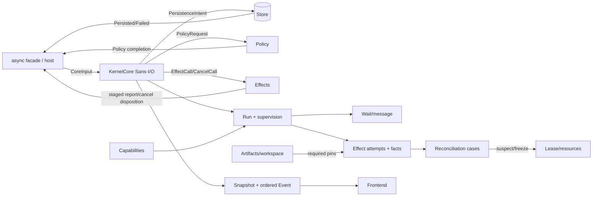

# Rust Agent Kernel 最小接口面提案（v3）

> 状态：吸收第二轮 5 域对抗复核与税系增补；研究日期：2026-08-19。  
> 目标场景：同一进程、同一版本、单一前端；kernel 作为 Rust 依赖库嵌入可信宿主。  
> 判定依据：[规范税系](./taxonomy.md)、[税系增补](./taxonomy-addendum.md)、[反模式清单](./anti-patterns.md)、[kernel/frontend 先例](../precedents/kernel-frontend-split.md)、[xi 与编辑器先例](../precedents/xi-and-editors.md)，以及本文末尾两轮裁决。

## 0. 一句话裁决

稳定窄腰不是 `Agent/Crew/Graph/Tool/UI`，而是：**一个单 owner、可持久恢复的事实状态机；宿主用带显式时间与权限的幂等命令驱动它，由薄 async facade 执行持久化、政策和外部 effect intent，并用足以从 cursor gap 恢复的 snapshot + 有序 event 观察它。**

v3 修正 v2 的九个已确认缺口：受让人明确的 capability、诚实的取消终态、按 attempt/fence 对账、retry 时 lease 重绑、真正可强制的 artifact pin、可用的 Rust DTO、`Policy::Ask` 回路、meter overage 事实和长期状态回收。它还把单次 `ReconcileUnknown` 提升为可恢复的 reconciliation case，把 effect outcome 改为阶段事实流，并加入一个严格受限的“创建任务 + 授予资源 + 首 effect”原子原语。

对架构的关键改判是：**稳定语义 core 是真 Sans-I/O；原 v2 的 async `Kernel` 保留为同 crate 的便利 facade，但不再冒充 core。** 五个高层宿主操作仍是 `open / submit / drive / snapshot / subscribe`；三个 async 宿主端口仍是 `Store / Policy / Effects`。

---

## 1. 概念模型与责任边界

### 1.1 核心名词（11 个）

| 名词 | kernel 拥有的最小含义 | 明确留给库使用者/前端 |
|---|---|---|
| **Kernel/Core** | 单线性化事实状态机；校验 input、产生 persistence/host intents | 线程、socket、认证、跨站共识 |
| **Run** | 稳定 ID、血缘、supervision 规则、预算、deadline、唯一诚实终态 | role、persona、业务 step DSL |
| **Command** | 幂等意图，含 ID、actor、authority、causation、CAS | UI click、登录和签名协议 |
| **Observation** | 完整 `Snapshot` 与同一事实模型的有序 `Event` | UI cache、token 流、历史分析仓库 |
| **Effect** | proposal、政策、attempt/fence、阶段事实、receipt、取消记录 | HTTP/MCP/LLM/设备实现、领域成功判据 |
| **Reconciliation** | Unknown case、证据追加、冲突保留、资源 suspect 与幂等闭合 | 探测协议、权威来源选择、物理纠正动作 |
| **Wait/Message** | 可恢复 join/timer/message/input 与有界协调事实 | 文案、业务 quorum、广播传输 |
| **Capability** | actor 绑定、可缩权/撤销、命令和 namespace scope | 企业 IAM、恶意宿主隔离 |
| **Budget** | Run 树硬上限、meter 预留/结算/overage 事实 | 价格换算、外部账单系统 |
| **Lease/Resource** | 声明式容量、原子集合、时间窗、fence、suspect/retire | 几何、设备健康、排程优化、日历 |
| **Artifact** | immutable ref、workspace CAS、producer/input provenance、effect pin | blob/Git/LIMS、领域 schema、merge |

`Reconciliation` 成为第 11 个名词，不是新增 executor：它只管控制面无法诚实判定现实后的 case 生命周期。探测、权威裁决和纠正 effect 均在外层。

### 1.2 三层责任

**Sans-I/O core 必须管：**

1. 单 Kernel 内 command/state/event 原子线性化、ID 幂等、revision/cursor；
2. Run/Wait/Effect/Reconciliation/Capability/Lease/Artifact 的恢复投影；
3. effect attempt、阶段事实、receipt、Unknown、retry 与 reconcile；
4. actor 绑定 capability、policy exchange、响应和证据审计；
5. 原子 claim set、受限 bound spawn、resource/effect fencing；
6. artifact/workspace pin、预算 reservation/settlement/overage；
7. terminal root 归档与 retired resource 回收条件。

**async facade / 库使用者必须管：**

- 驱动 `KernelCore::apply`，按其 intent 调用 Store/Policy/Effects，再把完成事实喂回 core；
- handler registry、领域状态、世界模型、freshness/质量/权威判断、空间冲突、优化器、队列和 SLA；
- 下游幂等、retry 分类、补偿、审批 quorum、reconciliation probe/裁决/纠正；
- 多线程 actor facade、进程隔离、升级 migrator、硬实时安全链路。

**前端只管：**

- 从 Snapshot/Event 投影；渲染 InputRequest；提交 Respond/Cancel/Reconciliation evidence；
- 展示 Unknown/Conflicted/Suspect/Overage；不得自行把它们改成成功、失败或安全释放。

### 1.3 关系图



---

## 2. 库而非 wire 协议；真 Sans-I/O core 与 async facade

### 2.1 为什么仍是进程内 Rust 库

当前仍没有多个独立发布 consumer、多语言 server 或跨机器信任边界，因此不冻结 JSON-RPC/socket/wire compatibility。xi 的复盘支持“不要无需求地分进程”，却不足以支持“core 内必须 await callback”。rust-api-patterns 与可测试状态机先例对这里更直接：协调语义应能在无 executor、无时钟、无 I/O 的环境确定性执行。

未来如出现独立版本 consumer、不可信插件或跨语言部署，应在 `KernelCore` 外加 protocol adapter；不能让当前 facade 的 Rust future 形状变成 wire 协议。

### 2.2 两层公开面

- `KernelCore`：真正 Sans-I/O；不拥有 Store/Policy/Effects，不创建线程，不读取时钟，不返回 future。`apply(input)` 只改变内存中的确定性状态并产生 intent。
- `Kernel`：薄 async facade；保留 v2 易用性和五个操作，负责调用三个端口并把 completion 喂回 core。
- facade 不是另一套语义。所有授权、状态迁移、事件和持久化 batch 只能由 core 产生。

这使 WASM 可用同步 host imports 或 JS promise 驱动 intent；FFI 可用 tagged DTO + 显式 pump，不需要跨 ABI 传 Rust future；测试可用纯值逐步模拟时间、Store conflict、Policy Ask、迟到 callback 和崩溃点。代价是低层用户必须处理两阶段 persistence acknowledgement；普通用户应使用 facade。

### 2.3 持久化与外调顺序

1. `apply` 产生带 `CommitToken` 的 `PersistenceIntent` 后，core 进入 pending-commit，除对应 persistence completion 外拒绝下一事实输入。
2. facade 仅在 Store CAS 成功后回灌 `Persisted`；失败回灌 `PersistenceFailed`，core 回到提交前状态或返回可分类错误。
3. Policy/Effects host request 只能在“其 claim 已持久化”的后续 `CoreOutput` 中出现。
4. callback completion 也先经 core 形成 state + events commit；commit 成功后 facade 才向调用者报告完成。
5. 因此外部 callback 期间不持有可变提交借用；多个 facade `drive` 可并存，但 attempt/fence 和 pending commit 保证唯一 owner。

---

## 3. v3 稳定公共 API 全集

### 3.1 DTO、derive 与演进规则

以下代码块共同构成稳定 public surface。为避免把每行淹没在重复属性中，采用下列**规范性 derive 规则**：

- 所有公开 ID/newtype：`Clone, Copy`（含 `String` 的 newtype 除外）、`Debug, PartialEq, Eq, PartialOrd, Ord, Hash, Serialize, Deserialize`；
- 所有其他公开 DTO：`Clone, Debug, PartialEq, Eq, Serialize, Deserialize`；
- `KernelCore`、`Kernel`、`EventStream` 不实现 DTO derive；
- 所有可能演进的公开 enum 标 `#[non_exhaustive]`；match 必须有 fallback；
- crate 公开依赖 `serde`，canonical persistence 编码版本由 `state_format` 标识，不承诺 serde 的任意默认编码就是长期格式；
- byte-array ID 均提供 `from_bytes/as_bytes/into_bytes`；String ID 均提供 `new/as_str/into_string`。调用方无需访问私有 tuple 字段，也无需 unsafe。

文中的 `Dto`/`IdDto` 是上述 derive 列表的排版缩写，不是实际宏；发布 crate 必须展开为真实 derive，编译测试验证完整 surface。

### 3.2 基础类型、预算、错误

```rust
use core::{future::Future, pin::Pin, task::{Context, Poll}};
use std::{num::{NonZeroU32, NonZeroUsize}, rc::Rc};

pub type LocalBoxFuture<'a, T> = Pin<Box<dyn Future<Output = T> + 'a>>;

// IdDto；所有固定宽度 ID 均有 from_bytes/as_bytes/into_bytes。
pub struct KernelId([u8; 16]);
pub struct CommandId([u8; 16]);
pub struct RequestId([u8; 16]);
pub struct CommitToken([u8; 16]);
pub struct ArtifactId([u8; 32]);
pub struct RunId([u8; 16]);
pub struct EffectId([u8; 16]);
pub struct WaitId([u8; 16]);
pub struct CapabilityId([u8; 16]);
pub struct LeaseId([u8; 16]);
pub struct ReconciliationId([u8; 16]);

// String ID 为 Clone 而非 Copy；均有 new/as_str/into_string。
pub struct SubjectId(String);
pub struct StableKey(String);
pub struct SchemaId(String);
pub struct ResourceId(String);
pub struct ResourceNamespace(String);
pub struct OperationId(String);
pub struct MeterId(String);

pub struct Revision(pub u64);
pub struct Cursor(pub u64);
pub struct TimestampMs(pub u64);
pub struct Fence(pub u64);
pub struct Payload { pub schema: SchemaId, pub bytes: Vec<u8> }

pub struct MeterLimit { pub meter: MeterId, pub max: u64 }
pub struct MeterAmount { pub meter: MeterId, pub amount: u64 }

pub struct BudgetLimit {
    pub max_depth: NonZeroU32,
    pub max_children: u32,
    pub max_concurrent: NonZeroU32,
    pub max_effect_attempts: NonZeroU32,
    pub max_messages: u64,
    pub max_items: u64,
    pub max_bytes: u64,
    pub max_payload_bytes: u64,
    pub meters: Vec<MeterLimit>,
}

pub struct BudgetUsage {
    pub children: u32,
    pub concurrent: u32,
    pub effect_attempts: u32,
    pub messages: u64,
    pub items: u64,
    pub bytes: u64,
    pub meters_reserved: Vec<MeterAmount>,
    pub meters_consumed: Vec<MeterAmount>,
    pub overages: Vec<BudgetOverage>,
}

pub struct BudgetOverage {
    pub effect: EffectId,
    pub attempt: u32,
    pub meter: MeterId,
    pub reserved: u64,
    pub consumed: u64,
    pub recorded_at: TimestampMs,
}

pub struct KernelConfig {
    pub id: KernelId,
    pub code_revision: String,
    pub limits: BudgetLimit,
    pub event_page_size: NonZeroUsize,
    pub effect_claim_ttl_ms: u64,
}

pub struct BootstrapAuthority { pub actor: SubjectId, pub scope: CapabilityScope }

#[non_exhaustive]
pub enum OpenMode {
    Create { now: TimestampMs, bootstrap: BootstrapAuthority },
    Recover,
}

#[non_exhaustive]
pub enum ErrorCode {
    NotFound, AlreadyExists, Conflict, InvalidTransition, StaleHandle,
    CursorExpired, BudgetExceeded, Backpressured, Unauthorized,
    DeadlineExceeded, CancellationTimedOut, NeedsMigration, CorruptState,
    Busy, HostUnavailable, Internal,
}

pub struct KernelError {
    pub code: ErrorCode,
    pub message: String,
    pub retry_after_ms: Option<u64>,
}

#[non_exhaustive]
pub enum HostErrorKind { Conflict, Unavailable, InvalidData, Permanent }
pub struct HostError {
    pub kind: HostErrorKind,
    pub code: String,
    pub message: String,
    pub retry_after_ms: Option<u64>,
}
```

ID 由 core 依据 KernelId、命令 ID、StableKey 和实体类别确定性派生并做碰撞检查；它们不是认证 secret。可信宿主身份仍由 capability + actor 核验，而不是“猜不到 ID”。

### 3.3 真 Sans-I/O core

```rust
pub struct KernelCore { _private: () }

impl KernelCore {
    pub fn create(config: KernelConfig, now: TimestampMs, bootstrap: BootstrapAuthority)
        -> Result<(Self, CoreOutput, CapabilityId), KernelError>;
    pub fn recover(config: KernelConfig, stored: StoredKernel)
        -> Result<(Self, CapabilityId), KernelError>;
    pub fn apply(&mut self, input: CoreInput) -> Result<CoreOutput, KernelError>;
    pub fn snapshot(&self, query: SnapshotQuery) -> Result<Snapshot, KernelError>;
}

#[non_exhaustive]
pub enum CoreInput {
    Submit { now: TimestampMs, command: Command },
    Drive(DriveRequest),
    HostCompleted(HostCompletion),
    Persisted { token: CommitToken },
    PersistenceFailed { token: CommitToken, error: HostError },
}

pub struct CoreOutput {
    pub persistence: Option<PersistenceIntent>,
    pub host_requests: Vec<HostRequest>,
    pub command_ack: Option<CommandAck>,
    pub drive_report: Option<DriveReport>,
}

pub struct PersistenceIntent {
    pub token: CommitToken,
    pub commit: StoreCommit,
}

#[non_exhaustive]
pub enum HostRequest {
    Authorize { request: RequestId, input: AuthorizationRequest },
    Execute { request: RequestId, call: EffectCall },
    CancelEffect { request: RequestId, call: EffectCancelCall },
}

#[non_exhaustive]
pub enum HostCompletion {
    Policy { request: RequestId, result: Result<PolicyRecord, HostError> },
    Effect { request: RequestId, result: Result<TimedEffectDispatch, HostError> },
    Cancel { request: RequestId, result: Result<TimedCancelDisposition, HostError> },
}
```

`create` 的初始 `CoreOutput.persistence` 必须先落盘；在 `Persisted` 前 bootstrap capability 不可用于提交。`recover` 从持久状态读回同一个 bootstrap `CapabilityId`，解决 root 创建前崩溃后失权问题。

### 3.4 async facade 与三个端口

```rust
pub trait Store {
    fn load<'a>(&'a self, kernel: &'a KernelId)
        -> LocalBoxFuture<'a, Result<Option<StoredKernel>, HostError>>;
    fn commit<'a>(&'a self, batch: StoreCommit)
        -> LocalBoxFuture<'a, Result<(), HostError>>;
    fn read_events<'a>(&'a self, query: EventQuery)
        -> LocalBoxFuture<'a, Result<EventPage, HostError>>;
}

pub trait Policy {
    fn authorize<'a>(&'a self, input: AuthorizationRequest)
        -> LocalBoxFuture<'a, Result<PolicyRecord, HostError>>;
}

pub trait Effects {
    fn execute<'a>(&'a self, call: EffectCall)
        -> LocalBoxFuture<'a, Result<TimedEffectDispatch, HostError>>;
    fn cancel<'a>(&'a self, call: EffectCancelCall)
        -> LocalBoxFuture<'a, Result<TimedCancelDisposition, HostError>>;
}

pub struct StoredKernel {
    pub revision: Revision,
    pub last_cursor: Cursor,
    pub code_revision: String,
    pub state_format: u32,
    pub state: Vec<u8>,
}

pub struct StoreCommit {
    pub kernel: KernelId,
    pub expected_revision: Revision,
    pub new_revision: Revision,
    pub state_format: u32,
    pub state: Vec<u8>,
    pub events: Vec<KernelEvent>,
}

pub struct EventQuery { pub kernel: KernelId, pub after: Cursor, pub limit: NonZeroUsize }
#[non_exhaustive]
pub enum EventPage {
    Batch { events: Vec<KernelEvent>, next: Cursor, caught_up: bool },
    Expired { earliest: Cursor, latest: Cursor },
}

pub struct Kernel { _private: () }
pub struct OpenedKernel { pub kernel: Kernel, pub bootstrap_authority: CapabilityId }

impl Kernel {
    pub async fn open(
        mode: OpenMode, config: KernelConfig, store: Rc<dyn Store>,
        policy: Rc<dyn Policy>, effects: Rc<dyn Effects>,
    ) -> Result<OpenedKernel, KernelError>;
    pub async fn submit(&self, now: TimestampMs, command: Command)
        -> Result<CommandAck, KernelError>;
    pub async fn drive(&self, request: DriveRequest) -> Result<DriveReport, KernelError>;
    pub async fn snapshot(&self, query: SnapshotQuery) -> Result<Snapshot, KernelError>;
    pub fn subscribe(&self, subscription: Subscription) -> EventStream;
}

pub enum WorkClass { Control, Interactive, Background }
pub struct DriveRequest {
    pub now: TimestampMs,
    pub classes: Vec<WorkClass>,
    pub max_transitions: NonZeroU32,
    pub max_effects: NonZeroU32,
}
pub struct DriveReport {
    pub transitions: u32,
    pub effects_attempted: u32,
    pub more_work: bool,
    pub next_wakeup: Option<TimestampMs>,
}
```

facade 仍 local-first、非 `Send`；这是便利层的选择，不是 core 限制。多线程宿主使用 owner task/thread + channel facade。未来可另供 `Send + Sync` facade，不改变 DTO/core。

### 3.5 Command、Run、监督、Wait 与消息

```rust
pub struct Command {
    pub id: CommandId,
    pub expected_revision: Option<Revision>,
    pub actor: SubjectId,
    pub authority: CapabilityId,
    pub causation: Option<CommandId>,
    pub kind: CommandKind,
}

#[non_exhaustive]
pub enum CommandKind {
    Run(RunOp),
    Coordinate(CoordinationOp),
    Effect(EffectOp),
    Authority(CapabilityOp),
    Resource(ResourceOp),
    Reconcile(ReconciliationOp),
    Maintenance(MaintenanceOp),
}

#[non_exhaustive]
pub enum RunOp {
    Start { spec: RunSpec },
    Spawn { parent: RunId, key: StableKey, spec: RunSpec, supervision: ChildSupervision },
    SpawnBound(BoundSpawn),
    Finish { run: RunId, outcome: RunOutcome },
    Cancel { run: RunId, reason: Payload },
}

pub struct RunSpec {
    pub kind: SchemaId,
    pub input: Payload,
    pub budget: BudgetLimit,
    pub deadline: Option<TimestampMs>,
}

#[non_exhaustive]
pub enum RunOutcome {
    Succeeded { result: Payload, artifacts: Vec<ArtifactId> },
    Failed { kind: String, detail: Payload },
    Cancelled { reason: Payload, compensation: Vec<EffectId> },
}

pub struct ChildSupervision {
    pub on_child_failure: OnChildFailure,
    pub on_parent_terminal: OnParentTerminal,
}
#[non_exhaustive]
pub enum OnChildFailure { RecordOnly, CancelParent, CancelSiblingsAndParent }
#[non_exhaustive]
pub enum OnParentTerminal { CancelChild, Detach }

pub struct BoundSpawn {
    pub parent: RunId,
    pub key: StableKey,
    pub spec: RunSpec,
    pub supervision: ChildSupervision,
    pub lease_key: StableKey,
    pub claims: Vec<ResourceClaim>,
    pub first_effect: Option<BoundEffectProposal>,
}

pub struct BoundEffectProposal {
    pub key: StableKey,
    pub operation: OperationId,
    pub resource: ResourceId,
    pub input: Payload,
    pub capability: CapabilityId,
    pub reservations: Vec<MeterAmount>,
    pub required_artifacts: Vec<ArtifactRequirement>,
    pub expected_workspace: Revision,
    pub class: WorkClass,
    pub not_before: Option<TimestampMs>,
    pub deadline: Option<TimestampMs>,
}

#[non_exhaustive]
pub enum CoordinationOp {
    Send { from: RunId, to: RunId, key: StableKey, payload: Payload, deadline: Option<TimestampMs> },
    Wait { run: RunId, key: StableKey, condition: WaitCondition },
    Respond { run: RunId, wait: WaitId, response: WaitResponse },
}

pub struct MessageMatch {
    pub schema: SchemaId,
    pub from: Option<RunId>,
    pub key: Option<StableKey>,
    pub expires_at: TimestampMs,
}
#[non_exhaustive]
pub enum WaitCondition {
    Children { runs: Vec<RunId>, mode: JoinMode },
    Message(MessageMatch), Input(InputRequest), Until(TimestampMs),
}
pub enum JoinMode { All, Any }
pub struct InputRequest {
    pub schema: SchemaId,
    pub prompt_key: String,
    pub context: Option<Payload>,
    pub expires_at: TimestampMs,
}
#[non_exhaustive]
pub enum WaitResponse { Input(Payload), Approve, Deny { reason: Payload }, Cancel }
```

`SpawnBound` 是 C1 的受限原子原语：一个 commit 内创建 child、把整组声明式 claims 授予 child，并可建立首个 effect；首 effect 自动绑定该次 grant 的全部相关 resource fences。任何一步校验失败则一个实体也不创建。它不接受任意 command vector、不跨既有 Run、不执行外部 effect，也不允许引用任意中间 ID。

监督语义是确定的：child 失败时按声明产生取消事实；`RecordOnly` 只发事实，由宿主订阅后提交自己的补偿/传播命令。parent 终态时，`CancelChild` 进入 child 的正常取消协议；`Detach` 仅切断监督边，血缘仍保留。Run 进入终态后拒绝新 Send/Wait；已提交消息保留为审计事实，开放的 message/input wait 变为 Cancelled，已匹配响应不回滚。取消最终必须由 `Finish { outcome: Cancelled {..} }` 或 kernel 在所有取消条件闭合后产生同一 outcome；绝不以 stream close 代替 Terminal。

### 3.6 Capability：受让人、kernel scope 与 namespace

```rust
#[non_exhaustive]
pub enum CommandClass {
    StartRoot, Spawn, SpawnBound, Finish, CancelRun, Send, Wait, Respond,
    ProposeEffect, RetryEffect, RecordEffect, CancelEffect,
    GrantCapability, RevokeCapability,
    DefineResource, RetireResource, AcquireLease, RenewLease, ReleaseLease,
    PublishArtifact, InvalidateArtifact,
    OpenReconciliation, AddReconciliationEvidence, ResolveReconciliation,
    ArchiveRoot, ForgetArchive,
}

#[non_exhaustive]
pub enum RunScope { Kernel, Subtree(RunId), Exact(Vec<RunId>) }
#[non_exhaustive]
pub enum ResourceScope {
    Exact(Vec<ResourceId>),
    Namespace(Vec<ResourceNamespace>),
}

pub struct CapabilityScope {
    pub runs: RunScope,
    pub commands: Vec<CommandClass>,
    pub resources: ResourceScope,
    pub operations: Vec<OperationId>,
    pub budget: BudgetLimit,
}

#[non_exhaustive]
pub enum CapabilityOp {
    Grant {
        grantee: SubjectId,
        parent: CapabilityId,
        scope: CapabilityScope,
        expires_at: Option<TimestampMs>,
    },
    Revoke { capability: CapabilityId },
}
```

Capability 原子绑定 `grantee`；Command.actor 必须等于 grantee。`RunScope::Kernel` 的 capability 存在 Snapshot 顶层而非某个 Run。Grant 必须是 parent 的缩权，namespace 也只能从同一或更窄 namespace 派生。

`ResourceNamespace` 是规范化 UTF-8 前缀，以 `/` 为 segment 边界；`city/a` 匹配 `city/a/order/7`，不匹配 `city/ab/7`。它解决未来订单/资源 ID 尚未定义时的合法委托，而不引入 regex/glob。若部署不愿预授 namespace，可采用 `Define` 后再 `Grant Exact` 的运行时流程。

最小授权流程：

```rust
// 1. Create/Recover 都返回 bootstrap_id；bootstrap 绑定 Alice。
// 2. Alice 用同一个可 Copy 的 bootstrap_id 作 authority 与 parent。
Command { actor: alice, authority: bootstrap_id, kind: CommandKind::Authority(
    CapabilityOp::Grant { grantee: bob, parent: bootstrap_id, scope: bob_scope, expires_at: None }
), .. }
// ack.created_capability = Some(bob_id)
// 3. Bob 提交：actor=bob, authority=bob_id；kernel 同 revision 核验 actor/scope/revoke。
// 4. Alice 提交 Revoke { capability: bob_id }。commit 后 Bob 的新命令和未 claim effect 均 Unauthorized；
//    已 dispatch 的物理动作不被伪称撤回，须 Cancel/fence/reconcile。
```

这使“每个批准者一张 capability + 各自 Input Wait + Join”可由公开 API 真实表达。Capability 在本提案中保护所有可变命令与 effect dispatch，不承诺同一可信宿主内部的读隔离；`snapshot/subscribe` 会向持有 Kernel facade 的宿主暴露投影，宿主必须在自己的前端/IAM 边界裁剪。若未来出现不可信同进程 reader，应另加带 observation authority 的 facade，而不是误称当前 namespace scope 能防止披露。

### 3.7 Effect、Policy Ask、阶段事实与 overage

```rust
pub struct RequiredLease {
    pub lease: LeaseId,
    pub resource: ResourceId,
    pub fence: Fence,
}

pub struct ArtifactRequirement {
    pub artifact: ArtifactId,
    pub producer: Option<RunId>,
}

pub struct EffectProposal {
    pub run: RunId,
    pub key: StableKey,
    pub operation: OperationId,
    pub resource: ResourceId,
    pub input: Payload,
    pub capability: CapabilityId,
    pub required_leases: Vec<RequiredLease>,
    pub required_artifacts: Vec<ArtifactRequirement>,
    pub expected_workspace: Revision,
    pub reservations: Vec<MeterAmount>,
    pub class: WorkClass,
    pub not_before: Option<TimestampMs>,
    pub deadline: Option<TimestampMs>,
}

#[non_exhaustive]
pub enum EffectOp {
    Propose(EffectProposal),
    Retry {
        effect: EffectId,
        previous_attempt: u32,
        previous_fence: Fence,
        replacement_leases: Vec<RequiredLease>,
        not_before: TimestampMs,
        reason: Payload,
    },
    Cancel { effect: EffectId, reason: Payload },
    Record {
        effect: EffectId,
        attempt: u32,
        fence: Fence,
        report: EffectReport,
        recorded_at: TimestampMs,
    },
}

pub struct EffectIntent {
    pub effect: EffectId,
    pub run: RunId,
    pub operation: OperationId,
    pub resource: ResourceId,
    pub input: Payload,
    pub capability: CapabilityId,
    pub required_leases: Vec<RequiredLease>,
    pub required_artifacts: Vec<ArtifactRequirement>,
    pub expected_workspace: Revision,
    pub idempotency_key: StableKey,
    pub attempt: u32,
    pub reservations: Vec<MeterAmount>,
    pub class: WorkClass,
    pub not_before: Option<TimestampMs>,
    pub deadline: Option<TimestampMs>,
}

pub struct AuthorizationRequest {
    pub intent: EffectIntent,
    pub exchanges: Vec<PolicyExchange>,
}
pub struct PolicyExchange {
    pub request: InputRequest,
    pub resolution: WaitResolution,
}
pub struct PolicyRecord {
    pub decided_at: TimestampMs,
    pub decision: Authorization,
    pub evidence: Option<ArtifactId>,
}
#[non_exhaustive]
pub enum Authorization {
    Allow,
    Deny { reason: Payload },
    Ask { request: InputRequest },
}

pub struct EffectCall { pub intent: EffectIntent, pub fence: Fence }
pub struct EffectCancelCall { pub effect: EffectId, pub attempt: u32, pub fence: Fence }

pub struct TimedEffectDispatch { pub recorded_at: TimestampMs, pub dispatch: EffectDispatch }
#[non_exhaustive]
pub enum EffectDispatch {
    Reported(EffectReport),
    Pending { external_ref: Payload, facts: Vec<EffectFact> , next_check: Option<TimestampMs> },
}

pub struct EffectReport {
    pub facts: Vec<EffectFact>,
    pub completion: Option<EffectCompletion>,
    pub external_receipt: Option<Payload>,
    pub charges: Vec<MeterAmount>,
}

pub struct EffectFact {
    pub key: StableKey,
    pub source: SubjectId,
    pub stage: EffectStage,
    pub certainty: EffectCertainty,
    pub evidence: Option<ArtifactId>,
    pub detail: Option<Payload>,
    pub observed_at: Option<TimestampMs>,
}
#[non_exhaustive]
pub enum EffectStage { Delivered, Accepted, Started, Observed, Confirmed, Other(SchemaId) }
#[non_exhaustive]
pub enum EffectCertainty { Confirmed, Unknown, Conflicted }
#[non_exhaustive]
pub enum EffectCompletion {
    Succeeded { output: Payload, artifacts: Vec<ArtifactId> },
    Failed { kind: EffectFailureKind, detail: Payload },
    Cancelled { detail: Payload },
}
#[non_exhaustive]
pub enum EffectFailureKind { Rejected, InvalidInput, Unavailable, TimedOut, Permanent }

pub struct TimedCancelDisposition {
    pub recorded_at: TimestampMs,
    pub disposition: CancelDisposition,
}
#[non_exhaustive]
pub enum CancelDisposition { Accepted, AlreadyFinished, NotInterruptible, Unknown }
```

Policy `Ask` 不再断路：Ask 产生绑定 effect/attempt 的 durable Input Wait；Respond 后的 resolution 被追加到 `PolicyExchange`，下一次 authorize 收到完整 exchange。Policy 可以 Allow/Deny/再次 Ask；同一响应不会被重复消费。Policy evidence 改用 ArtifactId，避免证据只存在可膨胀 Payload。

每个 effect attempt 可追加多条以 `(attempt, EffectFact.key)` 幂等的阶段事实。阶段顺序是事实偏序而非强制业务 FSM：`Delivered` 不蕴含 `Accepted`，`Observed` 不蕴含 `Confirmed`；`Other` 允许领域阶段，certainty 允许 Unknown/Conflicted。只有 `EffectCompletion` 令 effect 终态。

Record 和 reconciliation resolution 都必须带 attempt + fence。迟到 attempt 1 的事实可作为 attempt 1 的历史 evidence 入账，但绝不能结算 attempt 2。若与已知事实冲突则追加 Conflicted 并保持 reconciliation 开放，不做 last-write-wins。

Retry 保持 EffectId 和 audit 链，并以 `previous_attempt/previous_fence` 作 CAS；`replacement_leases` 原子替换下一 attempt 的 lease pins。替换项必须覆盖 proposal 所需资源、属于同 Run、当前有效且不 suspect。旧 attempt 的 pins 不被改写。

Artifact 强制发生在 authorize、claim 和 dispatch 三处：required artifact 必须存在、valid、producer 匹配（若指定），且 run workspace 必须等于 expected_workspace。失效或 workspace 前进使尚未 dispatch 的 attempt 拒绝；已 dispatch 的现实结果进入 reconcile，而不是被抹除。

Meter 结算规则：reservation 是 admission 上限，不是对外部现实的否认。kernel **总是接受当前 attempt/fence 的真实 receipt/charges**，即使 consumed > reserved 或树 limit；超额部分形成 `BudgetOverage` 和事件，释放 reservation，计入真实 consumed，并禁止该 Run/祖先下新的消费型 Spawn/Propose/Retry，直到宿主以 Finish/Cancel 收敛。Record、Cancel、Reconcile、Release 等 control 命令仍允许。adapter 应尽力不超 reservation；超额是可审计合约违约，不得造成结果黑洞。

### 3.8 Resource、原子 claim、suspect 与 Artifact

```rust
pub enum LeaseMode { Shared, Exclusive }
pub struct LeaseWindow { pub valid_from: TimestampMs, pub expires_at: TimestampMs }
pub struct ResourceClaim {
    pub resource: ResourceId,
    pub mode: LeaseMode,
    pub units: NonZeroU32,
    pub window: LeaseWindow,
}
pub struct ResourceDefinition { pub resource: ResourceId, pub capacity: NonZeroU32 }

#[non_exhaustive]
pub enum ResourceOp {
    Define(ResourceDefinition),
    Retire { resource: ResourceId, reason: Payload },
    Lease(LeaseOp),
    Artifact(ArtifactOp),
}
#[non_exhaustive]
pub enum LeaseOp {
    AcquireSet { run: RunId, key: StableKey, claims: Vec<ResourceClaim> },
    Renew { lease: LeaseId, expected: Vec<RequiredLease>, expires_at: TimestampMs },
    Release { lease: LeaseId, expected: Vec<RequiredLease> },
}
#[non_exhaustive]
pub enum ArtifactOp {
    Publish {
        run: RunId,
        expected_workspace: Revision,
        artifact: ArtifactRef,
        inputs: Vec<ArtifactId>,
    },
    Invalidate { run: RunId, artifact: ArtifactId, reason: Payload },
}

pub struct ArtifactRef {
    pub id: ArtifactId,
    pub media_type: String,
    pub size_bytes: u64,
    pub locator: String,
}
pub struct LeaseClaimGrant {
    pub resource: ResourceId,
    pub mode: LeaseMode,
    pub units: NonZeroU32,
    pub window: LeaseWindow,
    pub fence: Fence,
}
pub struct LeaseGrant { pub lease: LeaseId, pub claims: Vec<LeaseClaimGrant> }
```

`AcquireSet` 与 `SpawnBound` 的 claims 全有或全无。冲突只看同 ResourceId、重叠窗口、mode/units/capacity；领域可行性由宿主先判断。ResourceDefinition 在有 lease/case 时不可修改或重定义。

关键改动：lease 到期只结束软件授权，不自动证明现实资源安全可重授。若该 lease 从未绑定已 dispatch/Unknown effect，可直接 Expired；若绑定过尚未 Confirmed/terminal 的现实动作，则 lease 和资源进入 Suspect，fence 失效并阻止冲突 grant，直到 reconciliation resolution 明确 `ReleaseResources` 或 `KeepSuspect`。这落实税系 #19，但不让 kernel 猜设备状态。

`Retire` 立即拒绝新 claim；现有 lease/case 闭合前保持 Retiring，之后为 Retired。Retired 定义可由状态压缩移出 live capacity index，但其 ID 和终止事实保留在 archive/event。

### 3.9 Reconciliation 子协议

```rust
#[non_exhaustive]
pub enum ReconciliationSubject {
    EffectAttempt { effect: EffectId, attempt: u32, fence: Fence },
    Lease { lease: LeaseId },
    Resource { resource: ResourceId },
}

#[non_exhaustive]
pub enum ReconciliationOp {
    Open {
        key: StableKey,
        subject: ReconciliationSubject,
        reason: Payload,
        suspect_resources: Vec<ResourceId>,
        deadline: Option<TimestampMs>,
    },
    AddEvidence {
        case: ReconciliationId,
        expected_revision: Revision,
        evidence: ReconciliationEvidence,
    },
    Resolve {
        case: ReconciliationId,
        expected_revision: Revision,
        resolution: ReconciliationResolution,
        evidence: Vec<ArtifactId>,
    },
}

pub struct ReconciliationEvidence {
    pub key: StableKey,
    pub source: SubjectId,
    pub observed_at: TimestampMs,
    pub artifact: ArtifactId,
    pub assertion: Payload,
}

#[non_exhaustive]
pub enum ReconciliationResolution {
    EffectCompleted { attempt: u32, fence: Fence, completion: EffectCompletion },
    EffectStillUnknown { attempt: u32, fence: Fence, reason: Payload },
    SafeToRetry { attempt: u32, fence: Fence, reason: Payload },
    ReleaseResources { resources: Vec<ResourceId>, reason: Payload },
    KeepSuspect { resources: Vec<ResourceId>, reason: Payload },
    SupersededBy { case: ReconciliationId },
}
```

Unknown effect fact、Unknown cancel disposition、带现实动作的 lease expiry 都可由 kernel 自动 Open；宿主也可显式 Open。`(subject,key)` 和 evidence key 幂等。case 保存相互冲突的 evidence，不替宿主选权威；Resolve 用 expected_revision 防双裁决，追加 correction event，不改写旧事实。

`SafeToRetry` 只解除 retry gate，不自动 Retry；宿主仍须提交 EffectOp::Retry 并承担领域重复风险。`EffectCompleted` 必须与 subject 的 attempt/fence 相同。资源冻结 scope 由 Open 的 `suspect_resources` 声明并受 capability resource scope 核验。probe 和 correction 均可建普通 Effect，从而复用 policy、budget、artifact 和 lease 机制。

### 3.10 Ack、Snapshot 与长期回收

```rust
pub struct CommandAck {
    pub command: CommandId,
    pub revision: Revision,
    pub cursor: Cursor,
    pub created_run: Option<RunId>,
    pub created_wait: Option<WaitId>,
    pub created_effect: Option<EffectId>,
    pub created_capability: Option<CapabilityId>,
    pub created_reconciliation: Option<ReconciliationId>,
    pub lease: Option<LeaseGrant>,
}

pub struct SnapshotQuery {
    pub root: Option<RunId>,
    pub include_descendants: bool,
    pub include_terminal_roots: bool,
    pub include_archived: bool,
}

pub struct Snapshot {
    pub kernel: KernelId,
    pub revision: Revision,
    pub at_cursor: Cursor,
    pub code_revision: String,
    pub roots: Vec<RunId>,
    pub runs: Vec<RunView>,
    pub capabilities: Vec<CapabilityView>,
    pub resources: Vec<ResourceView>,
    pub reconciliations: Vec<ReconciliationView>,
    pub archives: Vec<ArchiveView>,
}

pub struct RunView {
    pub id: RunId,
    pub parent: Option<RunId>,
    pub supervision: Option<ChildSupervision>,
    pub detached: bool,
    pub spec: RunSpec,
    pub status: RunStatus,
    pub outcome: Option<RunOutcome>,
    pub cancellation_reason: Option<Payload>,
    pub deadline: Option<TimestampMs>,
    pub budget_limit: BudgetLimit,
    pub budget_usage: BudgetUsage,
    pub children: Vec<RunId>,
    pub messages: Vec<MessageView>,
    pub waits: Vec<WaitView>,
    pub effects: Vec<EffectView>,
    pub leases: Vec<LeaseView>,
    pub workspace_revision: Revision,
    pub artifacts: Vec<ArtifactView>,
}

#[non_exhaustive]
pub enum RunStatus { Pending, Running, Waiting, Cancelling, Succeeded, Failed, Cancelled }
pub struct MessageView {
    pub from: RunId, pub to: RunId, pub key: StableKey, pub payload: Payload,
    pub deadline: Option<TimestampMs>, pub committed_at: TimestampMs,
}
pub struct WaitView {
    pub id: WaitId, pub key: StableKey, pub condition: WaitCondition,
    pub state: WaitState, pub resolution: Option<WaitResolution>,
}
pub struct WaitResolution {
    pub actor: Option<SubjectId>, pub response: Option<WaitResponse>, pub resolved_at: TimestampMs,
}
#[non_exhaustive]
pub enum WaitState { Open, Resolved, Expired, Cancelled }

pub struct EffectView {
    pub id: EffectId,
    pub proposal: EffectProposal,
    pub state: EffectState,
    pub attempt: u32,
    pub fence: Option<Fence>,
    pub policy_exchanges: Vec<PolicyExchange>,
    pub policy: Option<PolicyRecord>,
    pub dispatch: Option<EffectDispatch>,
    pub facts: Vec<EffectFactView>,
    pub completion: Option<EffectCompletion>,
    pub cancel: Option<CancelRecord>,
    pub reconciliation: Option<ReconciliationId>,
}
pub struct EffectFactView {
    pub attempt: u32, pub fence: Fence, pub fact: EffectFact, pub recorded_at: TimestampMs,
}
pub struct CancelRecord {
    pub attempt: u32,
    pub fence: Fence,
    pub reason: Payload,
    pub disposition: Option<CancelDisposition>,
    pub recorded_at: Option<TimestampMs>,
}
#[non_exhaustive]
pub enum EffectState {
    Proposed, WaitingForApproval { wait: WaitId }, Authorized, Claimed, InFlight,
    Succeeded, Failed { kind: EffectFailureKind }, Cancelled, OutcomeUnknown,
    Reconciling { case: ReconciliationId }, RetryScheduled { at: TimestampMs }, CancelRequested,
}

pub struct CapabilityView {
    pub id: CapabilityId,
    pub grantee: SubjectId,
    pub parent: Option<CapabilityId>,
    pub scope: CapabilityScope,
    pub expires_at: Option<TimestampMs>,
    pub revoked: bool,
}
pub struct LeaseView {
    pub id: LeaseId, pub run: RunId, pub key: StableKey,
    pub state: LeaseState, pub claims: Vec<LeaseClaimGrant>,
}
#[non_exhaustive]
pub enum LeaseState { Active, Released, Expired, Suspect { case: ReconciliationId } }
pub struct ResourceView { pub definition: ResourceDefinition, pub state: ResourceState }
#[non_exhaustive]
pub enum ResourceState { Active, Retiring, Retired, Suspect { cases: Vec<ReconciliationId> } }
pub struct ArtifactView {
    pub artifact: ArtifactRef, pub producer: RunId, pub inputs: Vec<ArtifactId>,
    pub workspace_revision: Revision, pub valid: bool,
}

pub struct ReconciliationView {
    pub id: ReconciliationId,
    pub subject: ReconciliationSubject,
    pub reason: Payload,
    pub state: ReconciliationState,
    pub suspect_resources: Vec<ResourceId>,
    pub evidence: Vec<ReconciliationEvidence>,
    pub resolution: Option<ReconciliationResolution>,
    pub revision: Revision,
    pub deadline: Option<TimestampMs>,
}
#[non_exhaustive]
pub enum ReconciliationState { Open, Conflicted, Resolved }

#[non_exhaustive]
pub enum MaintenanceOp {
    ArchiveRoot { root: RunId, manifest: Option<ArtifactId> },
    ForgetArchive { root: RunId, expected_final_cursor: Cursor },
}
pub struct ArchiveView {
    pub root: RunId,
    pub outcome: RunOutcome,
    pub final_cursor: Cursor,
    pub archived_at: TimestampMs,
    pub manifest: Option<ArtifactId>,
}
```

Capability 从 RunView 移至 Snapshot 顶层，解决 target=None 无容器并避免重复。Snapshot 默认只返回 live roots/resources/cases；`include_archived` 返回轻量 ArchiveView，而不是已压缩的 messages/effect attempts。

`ArchiveRoot` 仅在整棵树 terminal、所有 Wait 关闭、Effect terminal、lease 非 Active/Suspect、reconciliation resolved 时成功。commit 后 core 删除该树的详细 current-state DTO，仅保留轻量 ArchiveView；完整历史依赖此前 Event/manifest 的宿主 retention。宿主确认 manifest 或事件已进入自己的长期归档后，可用 `ForgetArchive { expected_final_cursor }` 删除最后的 ArchiveView tombstone；此操作不重写历史事件，重复或 cursor 不符时拒绝。Retired resource 在无任何 live/archive 引用后也从 live Snapshot/capacity index 移除，只由事件/manifest 留痕。因此 active StoredKernel 不随已归档 root、settled effect 或 retired resource 无界增长。若宿主需要长期审计，归档前必须提供 immutable manifest 或配置 Store 事件归档。

### 3.11 Event 与订阅

```rust
pub struct Subscription { pub after: Cursor, pub filter: EventFilter, pub max_batch: NonZeroUsize }
#[non_exhaustive]
pub enum EventFilter {
    Kernel,
    Run { root: RunId, include_descendants: bool },
    Reconciliation { case: ReconciliationId },
}
pub struct EventStream { _private: () }
impl futures_core::Stream for EventStream {
    type Item = Result<EventBatch, StreamError>;
    fn poll_next(self: Pin<&mut Self>, cx: &mut Context<'_>) -> Poll<Option<Self::Item>>;
}
pub struct EventBatch { pub events: Vec<KernelEvent>, pub next: Cursor, pub caught_up: bool }
#[non_exhaustive]
pub enum StreamError { Gap { earliest: Cursor, latest: Cursor }, Closed, Host(HostError) }

pub struct KernelEvent {
    pub cursor: Cursor,
    pub revision: Revision,
    pub recorded_at: TimestampMs,
    pub run: Option<RunId>,
    pub command: Option<CommandId>,
    pub causation: Option<CommandId>,
    pub actor: Option<SubjectId>,
    pub authority: Option<CapabilityId>,
    pub kind: EventKind,
}
#[non_exhaustive]
pub enum EventKind {
    RunCreated { run: RunId, parent: Option<RunId>, spec: RunSpec },
    StateChanged { from: RunStatus, to: RunStatus, reason: Option<Payload> },
    MessageCommitted { message: MessageView },
    WaitChanged { wait: WaitView },
    PolicyDecided { effect: EffectId, record: PolicyRecord },
    EffectChanged { effect: EffectView },
    CapabilityChanged { capability: CapabilityView },
    ResourceChanged { resource: ResourceView },
    LeaseChanged { lease: LeaseView },
    ArtifactChanged { artifact: ArtifactView },
    ReconciliationChanged { case: ReconciliationView },
    BudgetCharged { usage: BudgetUsage },
    BudgetOverageRecorded { overage: BudgetOverage },
    Archived { archive: ArchiveView },
    Terminal { outcome: RunOutcome },
}
```

事件顺序保证：

1. 同一 KernelId cursor 严格递增；同一 revision 的事件连续；不同 Kernel 无顺序。
2. state + events 由同一个 Store CAS 提交；事件在 CAS 前不可观察。重复 CommandId 返回原 ack，不生成新时间或事件。
3. 每个 Run 恰有一个 `Terminal { outcome }`，且 outcome 与最终 RunStatus 同构：Succeeded/Failed/Cancelled。取消 reason 同时存在 outcome 与 RunView，不依赖易过期事件。
4. 同一 attempt 的 effect facts 按 commit cursor 排序；不从到达顺序推导领域阶段顺序。过时 attempt 不覆盖当前 attempt。
5. Cancel disposition、reconciliation evidence/resolution、overage、suspect/retire 和 archive 都进入 Snapshot 或其当前摘要及 Event。
6. `snapshot.at_cursor=C` 后订阅 `after=C`；Gap 后重新 snapshot。raw token/progress 可丢且不得驱动状态。

---

## 4. 关键语义与惯用组装

### 4.1 StableKey 作用域与幂等

- Spawn/SpawnBound：`(parent,key)`；Bound 内 lease/effect 分别由自己的 key 派生。
- Send：`(from,to,key)`；Wait：`(run,key)`；Effect：`(run,key)`；AcquireSet：`(run,key)`。
- EffectFact：`(effect,attempt,fact.key)`；Reconciliation：`(subject,key)`；evidence：`(case,evidence.key)`。
- 相同 key 但不同 canonical 内容返回 Conflict，不静默复用。

### 4.2 取消、监督与补偿

Run Cancel 是请求，不等于现实已停止。kernel 进入 Cancelling，取消开放 waits，按 supervision 传播，并对 in-flight effects 调用 cancel。`Accepted` 只表示 adapter 接受取消请求；`NotInterruptible/Unknown` 打开 reconciliation。所有 effect 已 terminal 或由领域 resolution 接受风险后，Run 才以 `RunOutcome::Cancelled` 发唯一 Terminal。compensation EffectId 列表只记录已执行补偿，不生成补偿策略。

child failure 的三种声明语义足以覆盖隔离、父失败和 fail-fast sibling group；更复杂 restart/backoff 由宿主订阅 `RecordOnly` 事件后用 StableKey Spawn/Retry。Detach 不创造新 root identity，只允许 child 在 parent terminal 后继续；Snapshot root 查询 include_descendants 时仍可发现它。

### 4.3 审批 quorum 与 Policy Ask

业务 quorum 仍不用 DSL：为每个批准者 Grant 不同 grantee capability，创建各自 child/Input Wait，再用 Children(All/Any) 汇合。`Policy::Ask` 用 effect 自身的 durable wait/exchange 回路，不要求 side channel。角色分离、不可同人和 N-of-M 仍由 IAM/Policy 决定；kernel 只强制每次 Respond 的 actor/capability。

### 4.4 外部现实对账

probe 是普通 Effect，产出 Artifact evidence，再以 AddEvidence 关联 case；人工核验可直接提交已发布 Artifact。Policy/应用决定来源权威和 resolution。kernel 的职责只到：保留 Unknown/Conflicted、不自动重授 suspect resource、按 attempt/fence 防错账、expected_revision 防双裁决、追加式闭合。

### 4.5 Artifact 与 compare-and-use

Effect artifact pin 只强制 kernel 拥有的 validity/workspace/provenance。外部数据库实体版本仍需做成事务型 Effect，并把采用版本写入 receipt Artifact。校准 Artifact invalidate 后，尚未 dispatch 的旧配方 effect 无法 claim；已经开始的实验进入 reconciliation，不能假装从未发生。

### 4.6 长时作业与硬实时边界

Effects::execute 必须有界 dispatch；长作业返回 Pending + external_ref + 当前阶段事实，后续 Record。Control drive 可推进 Cancel/Reconcile/lease expiry。PLC/E-stop/保护继电器必须独立于 kernel，再补记事实；v3 不承诺 OS、网络或设备响应的硬实时上界。

### 4.7 恢复、升级与跨 Kernel

Recover 返回持久 bootstrap ID，随后 snapshot live roots/cases，按 RunSpec 重建 handler。未完成 host request 依据 durable claim 重新发出同 request/attempt/fence。`NeedsMigration` 不得静默 Create；pin/drain 仍优先，migrator contract 暂不入运行窄腰。跨 Kernel 顺序、capability、lease、事务和 fork merge仍边界外。

---

## 5. 税系簇溯源、增补与公共项门槛

| Public 项 | 至少两个依据 |
|---|---|
| 真 Sans-I/O core + async facade | #18 Rust/Sans-I/O；WASM/FFI/确定性测试；rust-api-patterns 与嵌入场景 |
| grantee + 顶层 capability + namespace | #8 authority；审批/交通动态资源；port/lab/coding/ride/grid |
| Cancelled outcome + cancel record | #1 生命周期；#3 恢复；port/lab/coding/grid |
| reconciliation case + suspect resource | 新 #19；#5/#10；港口、实验室、coding/grid |
| attempt/fence record/reconcile | #5/#6/#19；coding、grid |
| Retry lease rebinding | #5/#10；实验室及所有长时资源 effect |
| required artifacts/workspace | #13 provenance；#5 claim gate；实验/编码/研究/芯片 |
| staged EffectFact + evidence | #5；#3/#19；港口、实验室、交通控制 |
| SpawnBound | 扩展 #9 task binding + grant；warehouse、port、lab |
| supervision declarations | #1/#11；编码、仓储、救灾等树形运行 |
| meter overage fact | #9 budget；#5 accounting；编码/研究及外部 adapter |
| Retire/Archive | #4 recovery/state；#9 resource lifecycle；长寿命交通/城市运行 |

税系增补正式吸收如下：

- 新增暂定 contested #19“外部现实对账、Unknown outcome 与控制面收敛”：case 身份、状态、阻断和幂等闭合归 kernel；probe、权威判断和纠正动作归外层。
- #5 outcome 由单次 Result 改为 delivered/accepted/started/observed/confirmed/other 阶段事实、certainty 与 evidence ref；领域成功判据仍外置。
- #9 扩为声明式 claim/capacity、原子 claim set 以及受限的 task binding + resource grant；优化和可行性仍外置。
- #14 收窄为观测权威、质量/新鲜度与领域有效性判定（app）；通用时间、来源、版本、provenance 和声明式 gate 分别落入 #3/#10/#13/#18。

仍拒绝扩面：workflow DAG/FSM DSL、任意 command batch、queue/dequeue、broadcast、领域 signal store、historical snapshot、quorum DSL、跨 Kernel transaction/CRDT、资源几何、模型/provider、UI DTO、数据库/telemetry。

---

## 6. 异步、错误、事件顺序与 derive 一致性摘要

1. core 同步确定性；facade async。所有时间来自 CoreInput/host completion，kernel 不读系统时钟。
2. submit 是 cancel-safe 线性化操作；Store CAS 成功前不返回 ack。future 被 drop 后，重试同 CommandId 得原 ack或重新完成未提交操作。
3. drive bounded；host callback 前先持久 claim；callback 由 RequestId + attempt/fence 去重。Policy/Effects 不得重入 facade。
4. `KernelError.code` 与 `HostError.kind` 是控制流；不得解析 message。Conflict/Gap 重新 snapshot；StaleHandle 不重试为当前 attempt；NeedsMigration 不 Create。
5. 事件只在 state 同 commit 成功后可见；一个 Run 一个同构 Terminal；cursor gap 后 Snapshot 闭合 live control state。
6. Unknown 不伪装 Failed；case 未闭合时 suspect resource 不自动 free。late evidence 追加到原 attempt/case，不覆盖当前 attempt。
7. receipt overage 永不拒收；它形成事实并关闭后续消费 admission，不抹除现实结果。
8. DTO derive、ID accessor、non_exhaustive 和 state_format 规则见 §3.1；CI 必须有一个外部 crate compile test，覆盖 Clone/Hash/serde、Grant ID 复用和 exhaustive fallback。
9. `Rc`/非 Send 仅是默认 facade；KernelCore 自身可放入宿主选择的同步容器，但本 API 不承诺对同一实例并发 apply。

---

## 7. 开放问题

1. 单 aggregate CAS 的真实性能上限；先 benchmark，再决定 delta store/shard，不预暴露 shard API。
2. `Send + Sync` async facade 是否有两个真实使用者；可新增 facade 而不改 core/DTO。
3. ResourceNamespace 的规范化是否需 URI 标准；v3 固定 segment 规则，暂不加 regex/glob。
4. archive manifest 的最低 schema 与 Store 长期审计 contract；当前由部署 retention 决定。
5. 长期升级是否真实无法 pin/drain；出现两个实现后再定义 migrator。
6. reconciliation authority/quorum 是否在多个实现中收敛出更窄 typed policy；当前保持 Payload + Artifact evidence。
7. staged facts 是否需要 source clock/sequence 通用字段；现有 observed_at + evidence 足够第一版，乱序源序列可放 evidence schema。
8. wire adapter 何时达到多个独立 consumer 和版本偏差门槛。

---

## 8. 最终取舍与删减检查

v3 的扩面只发生在无法由外层诚实补救的原子强制或恢复事实：grantee、cancel outcome、attempt/fence、lease rebinding、artifact pins、Policy exchange、overage、reconciliation/suspect、受限 binding 和 archive。它没有把 probe、权威判断、补偿、调度优化、DAG 或硬实时安全塞进 kernel。

### 8.1 真正的删减检查

以下是最接近过度设计的公共项；并非全部保留：

1. **`EffectReceipt`：删除。** v2 的单次 receipt 与分阶段事实/最终 completion 重复；v3 用 `EffectReport + EffectFact + EffectCompletion` 取代，避免两套 outcome 真相。
2. **`CapabilityOp::Grant.target`：删除。** 与 `CapabilityScope.runs` 重复且造成 kernel-level 无容器；v3 只保留 grantee + scope。
3. **`RunView.capabilities`：删除。** capability 可跨 kernel/subtree，放在 Run 内会重复或遗漏；只保留 Snapshot 顶层集合。
4. **`EffectOp::ReconcileUnknown`：删除。** 单次、无 attempt/fence、不能收多证据或冻结资源；由通用但有界 ReconciliationOp 替代。
5. **`ResourceOp::Retire`：保留。** 它是唯一阻止已退役动态资源继续 claim 并允许 live index 回收的事实；城市级长寿命运行和资源 admission 两个 concern 支持。
6. **`SpawnBound`：保留但严限。** warehouse/port/lab 三域独立要求 task binding + grant；拒绝扩成 `Vec<CommandKind>`，以免成为事务 DSL。
7. **`EffectStage::Other`：保留。** 港口/实验室已证明固定五阶段不是全集；它只扩展事实标签，不引入领域 FSM。

按“公开顶层命名 type/trait/type alias + inherent public method”为主计数单位（字段和 enum variant 另列为成员变化，不混入主计数），相对 v2：**新增 41，删除 2，净增 39**。新增 41 项主要来自真 Sans-I/O 泵、reconciliation/suspect、阶段 effect/policy exchange、supervision/bound spawn、archive/overage；删除的两个顶层类型是 `EffectReceipt` 与 `EffectOutcome`。此外实际删除或替换了 `Grant.target`、`RunView.capabilities`、`EffectOp::ReconcileUnknown`、`EventKind::ResourceDefined` 等成员，但它们不伪装成顶层项减量。该口径可直接从两版 Rust 代码块复数，避免把一个 enum 的十个 variants 与一个稳定类型混成同一种预算。

---

## 9. v1 十二路走查裁决摘要（保留）

说明：`接受` 修改稳定接口；`组装` 表示通用原语足够；`边界外` 表示真实但不属于单进程 kernel；`暂缓` 表示证据不足。以下保留 v1→v2 十二路结论，并标明被 v3 翻转者。

### 9.1 multi-agent-coding

- **接受：**显式时间、完整 Snapshot、EffectId/result/Retry、原子 LeaseSet、通用 meter、全命令 capability。
- **组装：**owner facade、验证 child/artifact/join、StableKey frontier。
- **v3 追加：**Ask exchange、attempt/fence、artifact pin、overage；local-first 从 core 属性降为默认 facade 属性。

### 9.2 deep-research

- **接受：**RunSpec/result 恢复、sender/key、meter、retry/detail。
- **组装：**frontier、manifest、验证门；**边界外：**mutable claim/index、价值队列、历史 snapshot。
- **v3 追加：**artifact pin 令 manifest gate 成为真实强制点。

### 9.3 support-triage

- **接受：**Effect Cancel、durable Input、Retry/Reconcile、完整交接 Snapshot。
- **组装：**SLA timer 重建、ticket reopen；**边界外：**技能队列/匹配器。
- **v3 追加：**取消 disposition 与 reason 在 Snapshot 闭合。

### 9.4 warehouse-robots

- **接受：**Pending/Record、capability、AcquireSet/window/capacity、完整 Snapshot、control lane。
- **边界外：**PLC 急停、高频观测；**暂缓（v2）：**任务+资源+派遣事务。
- **v3 翻转：**三域证据后接受受限 SpawnBound；仍拒绝任意 batch。

### 9.5 ride-dispatch

- **接受：**outcome、双资源原子锁、control lane；**组装：**offer fan-out；**边界外：**GPS、跨分片、外部 freshness CAS。
- **v3 追加：**namespace resource scope；Retire/Archive 接受单域缺陷，因为它同时闭合通用长期存储/资源生命周期。

### 9.6 quake-rescue

- **接受：**bounded dispatch、完整 recovery、Unknown view、capability、durable input。
- **组装：**广播确认、plan marker；**边界外：**world model、离线双主与硬实时。
- **v3 追加：**Unknown case、suspect freeze 和明确 supervision。

### 9.7 traffic-twin

- **接受：**Pending/Record、lease fence、control lane；**组装：**evidence manifest、多 child approval；**边界外：**高频世界模型、跨 Kernel。
- **v3 追加：**阶段事实取代“accepted 后只等最终 receipt”。

### 9.8 airspace-utm

- **接受：**未来 AcquireSet、authority、完整 snapshot、显式时间；**组装：**child approval/control handoff；**边界外：**联邦 transport/共识与 4D 几何。
- **v3 保持：**namespace scope 只管声明式 ID，不冒充空域几何。

### 9.9 grid-blackstart

- **接受：**资源集合、完整 snapshot、fencing、审计、control lane；**组装：**证据门、双人批准、补偿；**边界外：**分区双主。
- **v3 追加：**Recover bootstrap、attempt/fence reconcile、取消终态。

### 9.10 port-supplychain

- **接受：**sender/key、child result、effect output、审批审计、AcquireSet；**边界外/组装：**高频 ingress；**暂缓：**deadline mutation/migrator。
- **v3 追加：**grantee、Cancelled outcome、阶段事实、SpawnBound、reconciliation。

### 9.11 auto-science-lab

- **接受：**AcquireSet/window/capacity、Pending/Record、fencing、结果和 recovery、control lane；**组装/边界外：**样品本体、高频仪器流、领域排程。
- **v3 追加：**Retry lease rebinding、artifact pin、SpawnBound、suspect resource。

### 9.12 chip-tapeout

- **接受：**Pending effect、resource capacity、完整 result/recovery、retry、authority；**组装：**DAG/provenance；**边界外/暂缓：**跨 block transaction、在线 migrator。
- **v3 追加：**artifact/workspace pin 兑现 freeze 强制点；仍不加 DAG DSL。

### 9.13 汇总

- **接受的硬缺口：**显式时间、闭合 snapshot、effect ledger、retry/record/cancel、sender/key、capability、AcquireSet/fencing、bounded dispatch、control lane、meter，以及 v3 的 grantee/cancel outcome/reconciliation/artifact pin/overage/archive。
- **用原语组装：**验证门、quorum、广播确认、补偿、报告冻结、ticket reopen。
- **边界外：**高频世界模型、领域 scheduler/geometry、跨 Kernel 共识、硬实时、企业 IAM、wire protocol。
- **仍暂缓：**任意 typed transaction、deadline mutation、在线 migrator、通用 mutable claim ledger。

---

## 10. 第二轮走查裁决

| 缺陷 | 裁决 | v3 处置 |
|---|---|---|
| D1 Grant 无 grantee、kernel capability 无容器、Recover 失 bootstrap | **接受（5 域）** | Grant 加 grantee；capability 移 Snapshot 顶层；Create/Recover 都返回持久 bootstrap ID；ID 可 Copy/Clone。 |
| D2 Cancelled 无 outcome、reason/disposition gap 后丢失 | **接受（4 域）** | RunOutcome 加 Cancelled；RunView 保存 reason；EffectView 保存 CancelRecord/disposition；Terminal 同构。 |
| D3 ReconcileUnknown 无 attempt/fence | **接受（2 域）** | 删除该 op；case subject/resolution 和所有 Record 均带 attempt/fence，迟到事实只入原 attempt。 |
| D4 Retry 无法重绑 lease | **接受（单域但机制闭环）** | Retry 加 previous attempt/fence CAS 与 replacement_leases，保留 EffectId/历史 pins。 |
| D5 Artifact 强制点为空 | **接受（实验 + 三个 provenance 强域）** | Proposal/Intent/Bound 加 required_artifacts + expected_workspace，并在 authorize/claim/dispatch 强制。 |
| D6 Rust 字面不可用 | **接受（客观）** | 规范 ID accessors、Copy/Clone/Eq/Ord/Hash/serde；所有 DTO derive 与 non_exhaustive 策略显式化。 |
| D7 Policy Ask 断路 | **接受（单域但公共承诺自相矛盾）** | durable WaitResolution 进入 PolicyExchange，后续 authorize 获得全回路。 |
| D8 meter overage 未定义 | **接受（单域但账本完整性）** | 当前 receipt 永不拒收；记录 overage、真实 consumed，阻断新消费 admission，control 仍可收敛。 |
| D9 长寿命无回收 | **接受（单域 + 通用持久状态义务）** | Retire + 条件式 ArchiveRoot/ArchiveView；仅在无 live/suspect 引用后压缩。 |

D4、D7、D8、D9 虽各由单域直接提出，但不是领域便利字段：它们分别修复已经公开的 Retry、Ask、硬预算和持久恢复承诺的不可达/不闭合状态，因此接受优于“暂缓”。

---

## 11. 批判回应

### C1. typed multi-command transaction

**接受批判，拒绝 v2 的“再等两个实现”理由。** warehouse、port、lab 已构成三域证据，且税系 #9 明确要求 task binding + resource grant 原子性。v3 加 `SpawnBound`，但刻意不加 generic batch：只能新建一个 child、AcquireSet、可选首 effect；ID 由 kernel 在同 commit 派生，外调仍在 commit 后。它覆盖已证实原子需求，不成为事务语言。既有 Run 之间的任意 QC/route/dispatch 更新仍用 saga/StableKey。

### C2. local-first 与 Sans-I/O

**接受批判并改判为真 Sans-I/O core + 可选 async facade。** xi 只足以反对无需求的进程分离，不足以证明 callback 应嵌进 core。v2 名称不诚实。v3 的 `KernelCore::apply` 无 future/I/O/时钟，产生 persistence/policy/effect intents；`Kernel` facade 才 await 三端口。WASM/FFI 得到可 pump 的值接口，测试可穷举崩溃和迟到顺序；普通 Rust 用户仍有五个 async 操作。代价是公开低层两阶段 persistence，但只存在一个语义实现。

### C3. 监督与失败传播

**接受。** Spawn 声明 `OnChildFailure` 和 `OnParentTerminal`；提供 record-only、cancel parent、fail-fast siblings，以及 cancel child/detach。取消通过正常协议传播，不把 child failure 自动等同 parent failure。终态 Run 拒绝新消息；已持久消息保留审计，开放 wait 取消，已匹配事实不回滚。复杂 restart/compensation 由宿主响应事件组装。

### C4. Capability 端到端可用性

**接受。** v3 给出 bootstrap→Grant(grantee)→Bob submit→revoke 的最小流程；ID derive 使同一 bootstrap 值可安全复用。动态 ResourceId 采用 segment-boundary namespace scope，Exact 仍可用于最小授权；不采用 regex/glob。Create/Recover 都返回持久 bootstrap，kernel-level capability 在 Snapshot 顶层可恢复。

### C5. 只加不减偏置

**接受。** §8.1 审查七个高风险项并实际删除四类重复/错误公共项：EffectReceipt、Grant.target、RunView.capabilities、ReconcileUnknown；保留 Retire、SpawnBound、EffectStage::Other 时分别给出跨 concern/跨域证据。v3 仍是净增，因为第二轮证明的闭环事实多于可删重复项，但净增不等于未经删减。

---

## 12. v3 相对 v2 的变更账本

**新增顶层项：41。** 主要是 `KernelCore/CoreInput/CoreOutput` 泵与 host intents、Reconciliation case/subject/evidence/resolution/suspect states、EffectFact/stage/certainty/completion、PolicyExchange、supervision/SpawnBound、namespace、archive/overage。

**删除顶层项：2。** `EffectReceipt` 与 `EffectOutcome` 被 `EffectReport + EffectFact + EffectCompletion` 取代。另有旧 `EffectOp::ReconcileUnknown`、Grant `target`、Run 内 capability 容器、`ResourceDefined` 事件等成员级删除/替换；按本节主口径不将字段或 variant 混计为顶层项。

**顶层公共项净增：39。** 计数口径是 Rust 代码块中的公开顶层命名 type/trait/type alias 与 inherent public method；v2 为 109，v3 为 148。trait method 和 struct field 是既有契约成员，但不重复计入主数。未来新增仍必须有至少两簇/两域证据，或证明现有公开承诺存在不可达状态。
